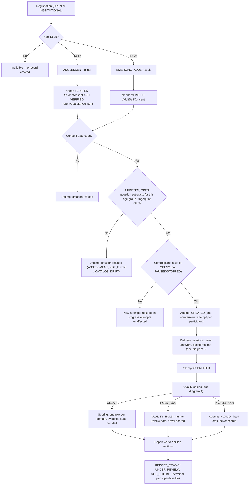
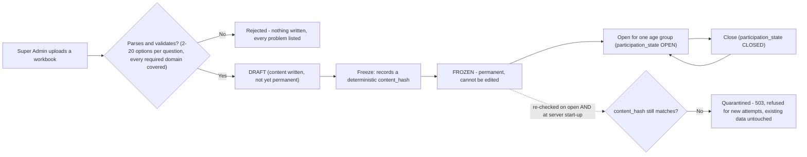
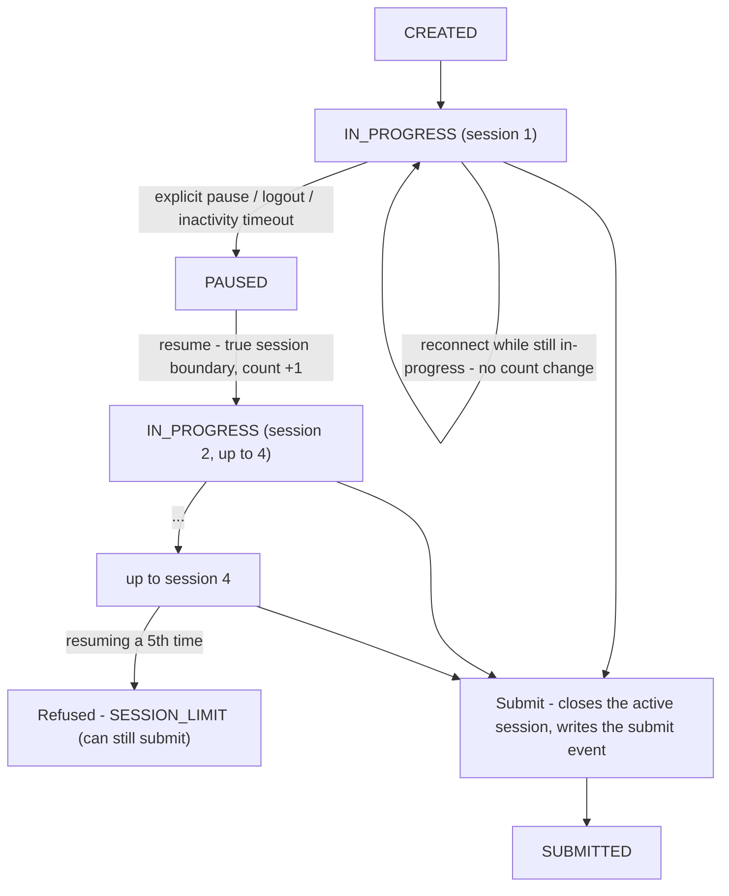
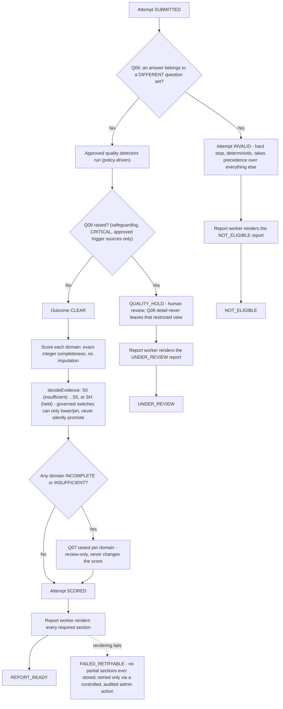

# Santulan Flowchart

The reference flow through the platform: registration → age routing → consent → an open question set → an attempt →
quality → score → evidence state → report. Question-set upload/freeze/open/close is a separate flow feeding the
"open question set" step. This is a picture of `backend.md` sections 9-13 and `database.md`'s state machines — read
those for the field-level detail; this file is the map of how the pieces connect.

## 1. End-to-end participant lifecycle

## 2. Question-set lifecycle (feeds "an open question set exists", above)

Only one set can be `OPEN` per age group at a time. A quarantined set stays quarantined until the underlying content
question is resolved (it is not an automatic or silent recovery).

## 3. Delivery: sessions, answers, pause and resume

Each answer save is its own small transaction: verify the attempt is writable and the question belongs to the
attempt's frozen set → validate the option position → retire the previous current answer → insert the new version →
log a `RESPONSE_SAVED` event → update last activity. An idempotency key on each save means a network retry can never
create a duplicate logical answer.

## 4. Quality, scoring and reports

`response_events` records what happened *during* an attempt (pauses, resumes, saves); `audit_logs` records
*administrative* actions (an admin reviewing a flag, resetting a credential, exporting research data, viewing or
exporting a participant's raw answers). They are two different trails for two different audiences.

## Where to look next

- `backend.md` — the full narrative version of every flow above, plus authentication, workers, and how to trace one
  HTTP request through the code layer by layer.
- `database.md` — the entity-relationship diagram and what each MongoDB collection is for.
- `backend/README.md` — operational detail: scripts, environment variables, the scoped data-access layer, CI, logging.
