# Santulan: Project Guide and Visual Flowcharts

This document explains the Santulan project in simple language. It is written for a developer who has just opened the repository and does not yet know the product, the architecture, or the important business rules.

The diagrams use **Mermaid**. GitHub and Mermaid-enabled Markdown previews render them as visual diagrams. If a preview shows code instead of a diagram, install a Mermaid Markdown preview extension or view the file on GitHub.

> Short version: Santulan is a web application for people aged 13 to 25. A participant registers, completes consent, answers a governed questionnaire, and receives a capability report. Administrators manage participants, institutions, question sets, report wording, quality review, and research exports.

## 1. The project in one picture

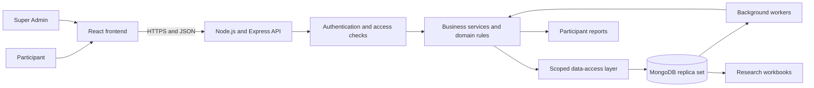

The project is a **modular monolith**:

- It has one React frontend.
- It has one Express backend process.
- The backend contains several feature modules, but they run together.
- It uses MongoDB directly through the official driver. There is no SQL and no ODM such as Mongoose.
- Background workers run inside the backend process when enabled by environment variables.

## 2. Why Santulan exists

Santulan collects self-reported answers about seven capability domains. It supports two age groups:

| Age | Internal group | Consent route |
|---|---|---|
| 13 to 17 | `ADOLESCENT` | Student assent and parent/guardian consent |
| 18 to 25 | `EMERGING_ADULT` | Adult self-consent |

The seven domains are:

| Code | Domain |
|---|---|
| `C1` | Body and Self-Regulation |
| `C2` | Emotional Capability |
| `C3` | Relational and Social Capability |
| `C4` | Identity and Self-Concept |
| `C5` | Values, Purpose and Future Agency |
| `C6` | Adaptability and Resilience |
| `C7` | Self-Directed Learning and Executive Capability |

Santulan is not designed to diagnose a person or rank them against other people. The system deliberately uses cautious wording, keeps unsupported content hidden, and fails closed when required approved content is missing.

## 3. Who uses the system

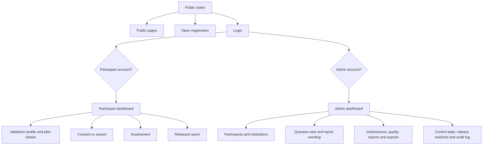

### Participant

A participant can:

- register or receive an institutional account;
- log in with a Santulan ID and password;
- complete profile and pilot-study information;
- complete the required consent flow;
- start, pause, resume, and submit an assessment;
- see the status of their submission;
- view only their own released report sections.

### Super Admin

A Super Admin can:

- manage institutions, cohorts, participants, and roster imports;
- upload, validate, freeze, open, and close question sets;
- add and approve controlled report wording;
- pause or stop assessment participation;
- review submissions and quality flags;
- retry failed reports;
- request and download research exports;
- review the audit log and change release switches.

### System worker

A worker is not a human account. It is trusted backend code that performs delayed work:

- pause inactive sessions;
- quality-check and score submitted attempts;
- generate reports;
- generate research export workbooks.

## 4. Frontend architecture

The frontend is in [`frontend/src`](frontend/src). It uses React, React Router, CSS Modules, and a small API client.

```mermaid
flowchart TD
    APP[App.js] --> SESSION[SessionContext]
    APP --> ROUTER[React Router]

    ROUTER --> PUBLIC[Public pages]
    ROUTER --> REG[Registration pages]
    ROUTER --> STUDENT[Participant pages]
    ROUTER --> ADMIN[Admin pages]

    STUDENT --> API[santulanApi.js]
    ADMIN --> API
    REG --> API

    API -->|Bearer token and JSON| BACKEND[/api/v1]
```

Important frontend files:

| File or folder | Purpose |
|---|---|
| [`frontend/src/App.js`](frontend/src/App.js) | Defines public, participant, and admin routes |
| [`frontend/src/services/SessionContext.jsx`](frontend/src/services/SessionContext.jsx) | Keeps the signed-in browser session |
| [`frontend/src/services/santulanApi.js`](frontend/src/services/santulanApi.js) | Central place for backend HTTP calls |
| [`frontend/src/pages/participant`](frontend/src/pages/participant) | Participant dashboard, assessment, profile, and results |
| [`frontend/src/pages/admin`](frontend/src/pages/admin) | Admin dashboard and operational screens |
| [`frontend/src/components`](frontend/src/components) | Reusable interface components |
| [`frontend/src/styles`](frontend/src/styles) | Shared visual tokens, fonts, and page styles |

The browser does **not** calculate official scores, decide permissions, or decide which report content is released. Those decisions belong to the backend.

## 5. Backend architecture

The backend is in [`backend/src`](backend/src). It follows a layered MVC-style structure. A request normally moves through these layers:

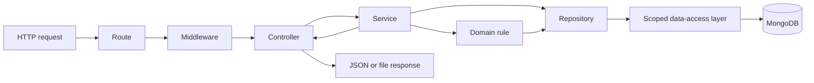

### What each layer does

| Layer | Simple meaning | Examples |
|---|---|---|
| Route | Connects a URL and HTTP method to code | `POST /attempts/:id/submit` |
| Middleware | Checks authentication, authorization, validation, throttling, and correlation IDs | `requireParticipantToken` |
| Controller | Reads HTTP input and sends the HTTP response | `delivery.controller.js` |
| Service | Coordinates a complete business use case | `submitService.js` |
| Domain rule | Contains pure state and calculation rules | `attemptRules.js`, `scoringRules.js` |
| Repository | Gives business-friendly database operations | `delivery.js`, `reports.js` |
| Scoped data access | Applies visibility and write restrictions to every collection call | `models/db/dal.js` |
| MongoDB | Stores persistent documents, indexes, validators, and research views | database `santulan` |

### Example: submitting an assessment

```mermaid
sequenceDiagram
    actor Participant
    participant UI as React AssessmentPage
    participant API as santulanApi.js
    participant Route as Express route
    participant Auth as Auth middleware
    participant Controller as delivery.controller
    participant Service as submitService
    participant Store as Scoped store
    participant DB as MongoDB

    Participant->>UI: Select Submit
    UI->>API: submit attempt
    API->>Route: POST /api/v1/attempts/:id/submit
    Route->>Auth: Verify participant token
    Auth->>Controller: Verified participant identity
    Controller->>Service: Submit this owned attempt
    Service->>Store: Run transaction
    Store->>DB: Close session and move attempt to SUBMITTED
    DB-->>Store: Commit
    Store-->>Service: Submission result
    Service-->>Controller: Safe response object
    Controller-->>UI: 200 response
```

The participant ID comes from the verified token. The backend does not trust a participant ID supplied by the browser.

### Important backend files

| File or folder | Purpose |
|---|---|
| [`backend/src/server.js`](backend/src/server.js) | Checks database readiness, starts HTTP, and starts enabled workers |
| [`backend/src/app.js`](backend/src/app.js) | Creates Express, CORS, health routes, API mounting, and error handling |
| [`backend/src/routes/v1/santulan.routes.js`](backend/src/routes/v1/santulan.routes.js) | Lists the complete API surface |
| [`backend/src/controllers`](backend/src/controllers) | HTTP adapters grouped by feature |
| [`backend/src/services`](backend/src/services) | Business workflows grouped by feature |
| [`backend/src/services/domain`](backend/src/services/domain) | State machines and calculation rules |
| [`backend/src/models/repositories`](backend/src/models/repositories) | Database operations used by services |
| [`backend/src/models/db`](backend/src/models/db) | MongoDB client, scopes, transactions, and access enforcement |
| [`backend/src/models/schema`](backend/src/models/schema) | Collections, validators, indexes, roles, and views as code |
| [`backend/src/jobs/workers`](backend/src/jobs/workers) | Periodic background processing |
| [`backend/db/migrations`](backend/db/migrations) | Forward-only database changes |

## 6. Complete participant journey

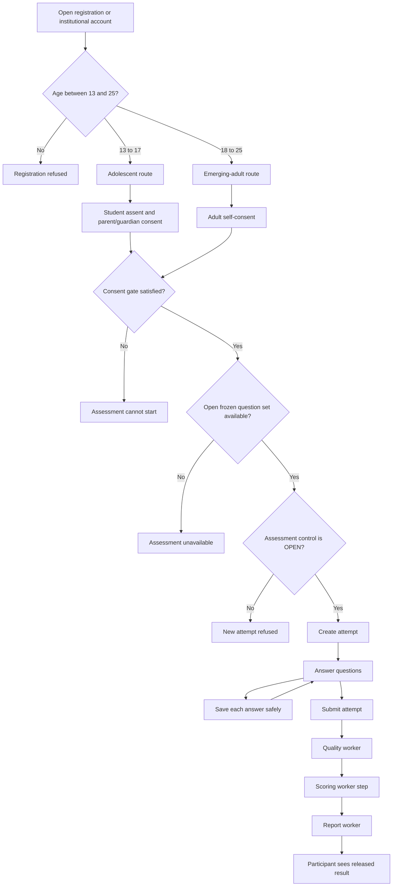

Important idea: registration, consent, assessment delivery, scoring, and reporting are separate stages. Finishing one stage does not automatically mean every later stage succeeded.

## 7. Registration and consent

### Registration routes

There are two main registration paths:

1. **Open registration**: a person registers directly and receives a Santulan identity.
2. **Institutional registration**: an administrator creates participants individually or through a roster import.

The current development identity adapter supports Santulan ID and password login. Real OTP/SMS routes are intentionally disabled until a real provider is integrated.

### Consent gate

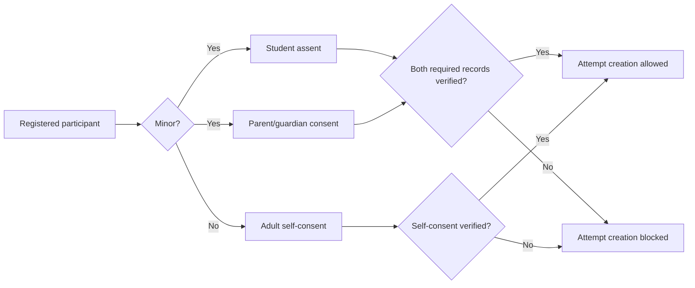

Consent does not create an assessment attempt. It only opens the gate that allows attempt creation.

## 8. Question-set lifecycle

A question set is the versioned questionnaire used by an attempt. Administrators upload it as a workbook.

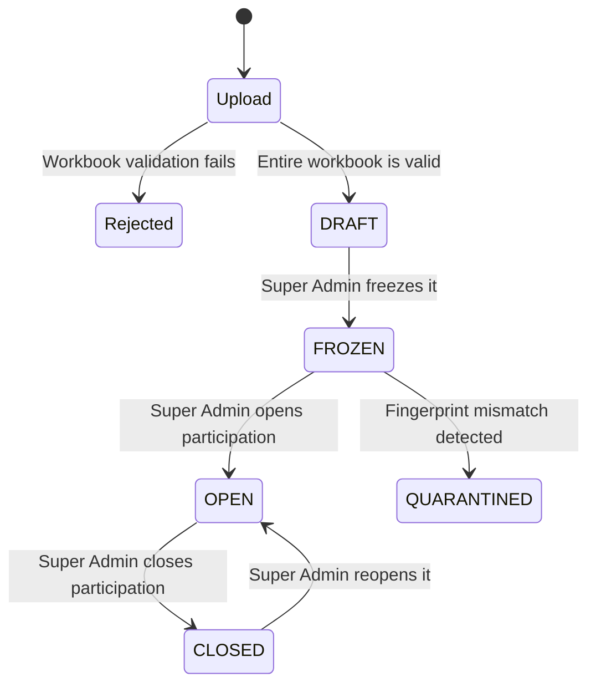

### Why freeze a set?

Freezing creates a deterministic content hash. The text, options, order, and other governed content become permanent. This ensures an attempt always points to the exact questionnaire the participant saw.

### Main rules

- The whole workbook is validated before it is written.
- A validation failure writes nothing and reports all detected problems.
- Only one question set can be open for an age group at a time.
- A frozen set cannot be silently edited.
- Open sets are fingerprint-checked when opened and when the server starts.
- A changed fingerprint quarantines the set instead of accepting uncertain content.

## 9. Assessment delivery

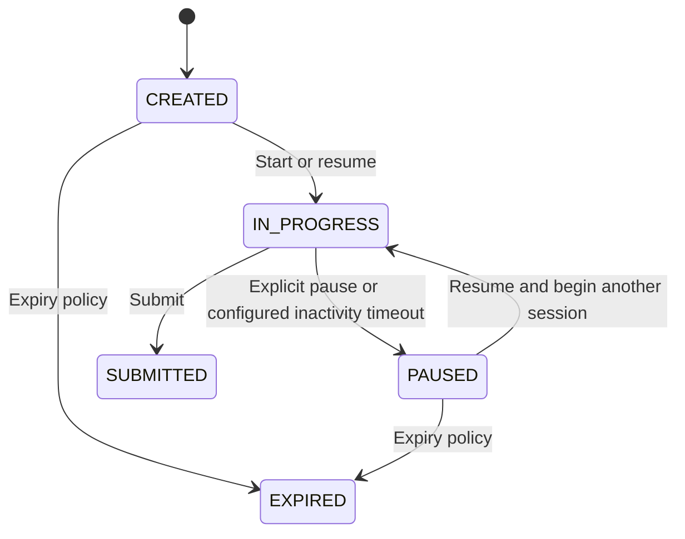

### Saving an answer

Each answer save is a small transaction:

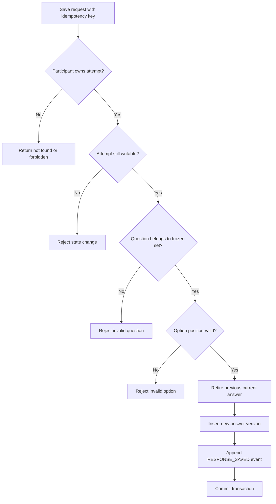

The idempotency key prevents a network retry from creating a second logical save.

### Sessions

- Reconnecting to the same active session does not increase the session number.
- Resuming after a real pause creates a new session boundary.
- The system permits up to four assessment sessions.
- Reaching the resume limit does not destroy existing answers; the participant can still submit.

## 10. Quality, scoring, and report workers

After submission, the participant-facing HTTP request is finished. Background workers continue the pipeline.

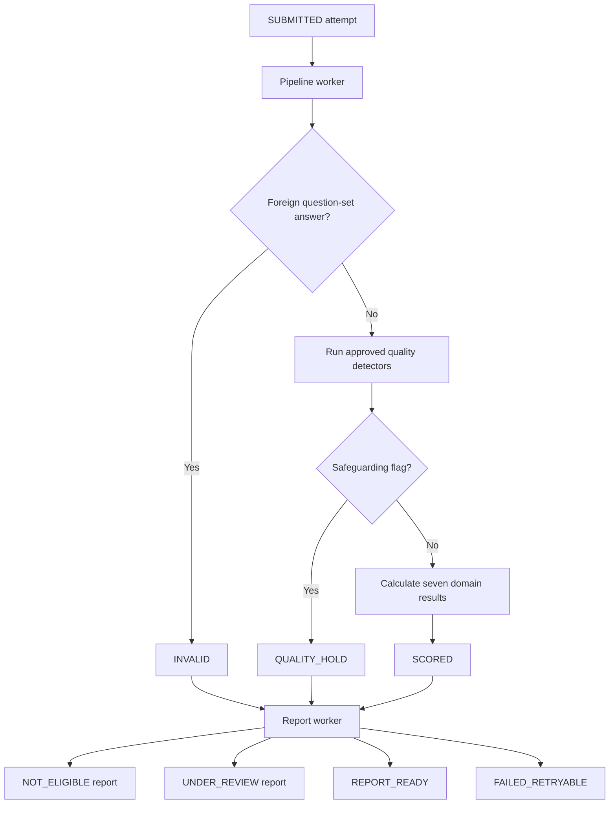

### Quality

Quality runs before scoring.

- `Q06` is a hard integrity failure. It makes the attempt invalid.
- `Q09` is a safeguarding route. It creates a quality hold and requires the protected human workflow.
- Other quality flags can be review information without changing the calculated score.
- Participants never receive the private reason behind a safeguarding hold.

### Scoring

The backend calculates scores from saved responses. It does not accept scores from the browser.

- One score result is stored for each domain `C1` to `C7`.
- Missing answers are counted exactly.
- Missing values are not invented or imputed.
- Completeness determines whether a domain is complete, an early estimate, incomplete, or insufficient.
- Evidence states control which interpretation is allowed.
- Release switches can permit stronger evidence behavior, but they cannot silently create evidence.

### Evidence states in simple language

| State | Simple meaning |
|---|---|
| `S0` | Not enough information to interpret |
| `S1` | Research-only result; descriptive interpretation is not released |
| `S2` and above | Approved descriptive wording may be used |
| `SH` | Held; normal interpretation is not shown |

The safe default is research-only evidence. The `pilotS2` release switch must be deliberately enabled before pilot-level wording can be used.

## 11. How report generation works

The platform report is a collection of immutable section snapshots. A participant sees only released sections.

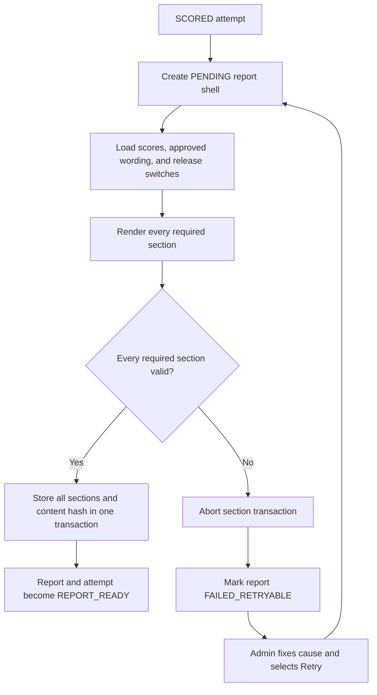

### Why an attempt can remain `SCORED`

`SCORED` means the mathematical scoring step succeeded. It does **not** mean the report was successfully built.

For an `S2` or higher domain, the report needs approved wording for four layers:

1. `MEANING`
2. `PATTERN`
3. `STRENGTH`
4. `GROWTH`

Seven domains multiplied by four layers means a complete `S2` English wording set normally needs **28 approved entries**.

If one required entry is missing:

- the renderer raises `WORDING_MISSING`;
- no partial report sections are stored;
- the report becomes `FAILED_RETRYABLE`;
- the attempt correctly stays `SCORED`;
- a Super Admin adds and approves the missing wording in **Admin > Report wording**;
- a Super Admin retries the report in **Admin > Reports**.

This is intentional safety behavior, not a scoring failure.

### Two report systems that should not be confused

| Report | Audience | Source |
|---|---|---|
| Platform participant report | Participant | Governed `report_sections` and approved `interpretation_rules` |
| Pilot PDF | Super Admin only | Ported pilot-kit renderer with sample content |

The pilot PDF endpoint is an admin review tool. Its sample wording does not automatically become approved participant wording.

## 12. Background workers

Workers poll for eligible records and process them in small batches. They use compare-and-set state changes, so two worker instances cannot safely claim the same transition twice.

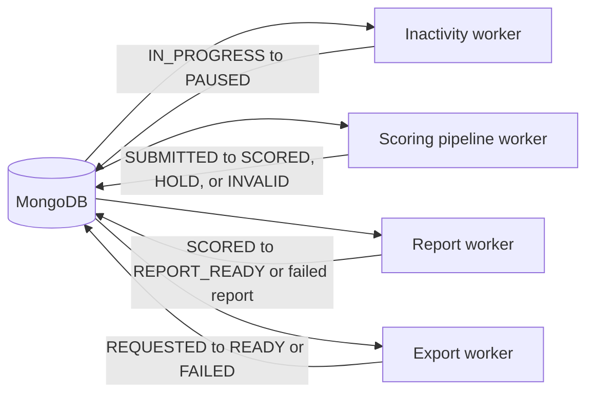

| Worker | Configuration | Main job |
|---|---|---|
| Inactivity | `SESSION_INACTIVITY_MINUTES` | Pause inactive in-progress attempts |
| Pipeline | `SCORING_PIPELINE=on` | Run quality and scoring |
| Report | `REPORT_WORKER=on` | Build participant reports |
| Export | `EXPORT_WORKER=on` | Build research workbooks |

Workers are disabled unless their configuration enables them. When debugging a record that appears stuck, check the record state, worker configuration, worker logs, and the related failure code.

## 13. Database in simple groups

The complete database model is documented in [`database.md`](database.md). This is the smaller mental model.

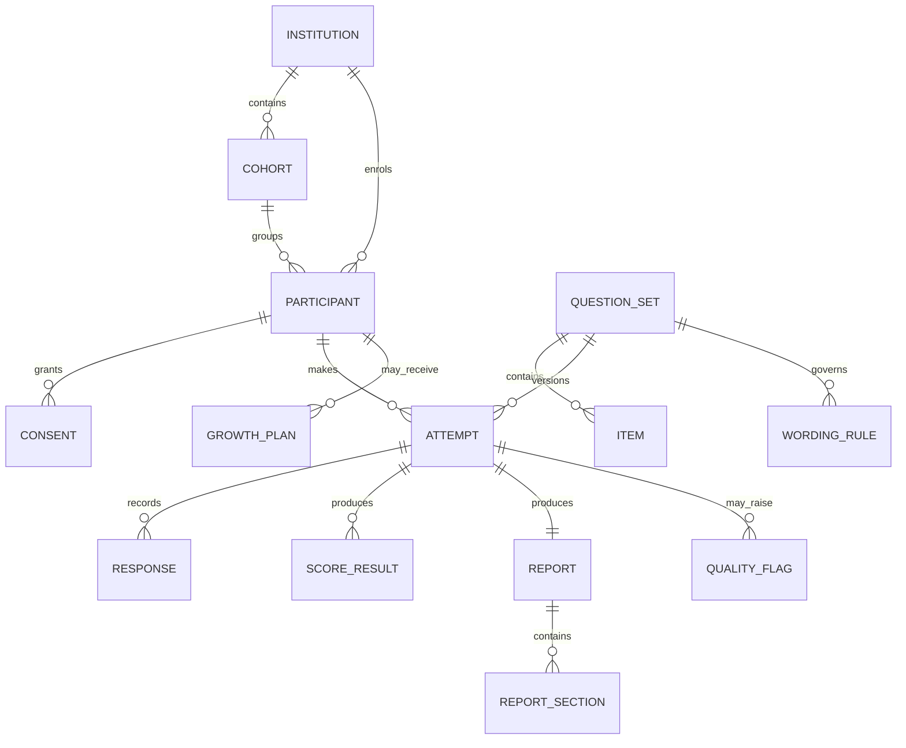

### Collection groups

| Group | What it stores |
|---|---|
| Identity and organisation | Participants, admin users, institutions, cohorts, credentials |
| Consent | Consent and assent records and protocol references |
| Assessment content | Assessment versions, items, options, controlled wording, actions, prompts |
| Delivery | Attempts, sessions, responses, response events |
| Quality and scoring | Quality flags and seven domain score results |
| Reporting | Reports, report sections, growth plans, pathways |
| Research and operations | Export requests, audit logs, release switches, control state |

### Why MongoDB needs a replica set

Santulan uses multi-document transactions. MongoDB supports those transactions through a replica set, even in local development where there is only one MongoDB member.

## 14. Authentication and data access

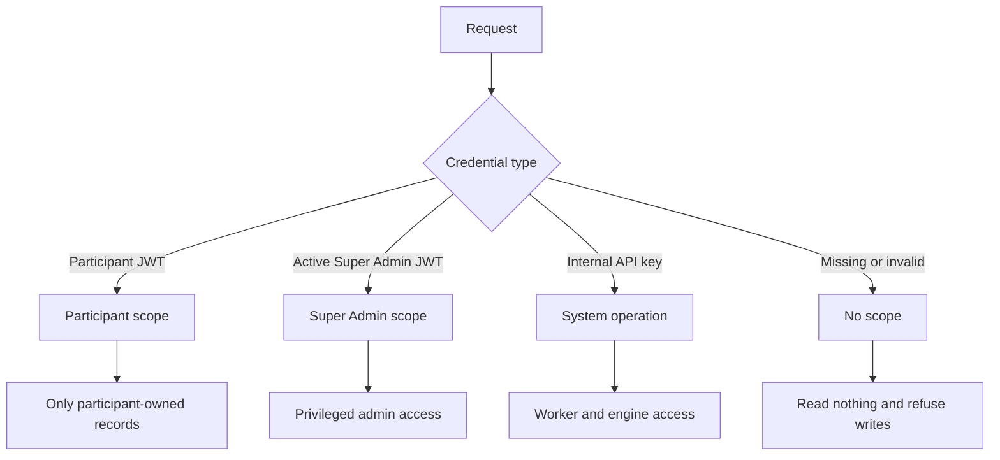

The scope is built from a verified session, never from a request body or query parameter.

The scoped data-access layer:

- adds ownership filters to reads;
- checks whether writes are allowed;
- limits which fields may be updated;
- provides no normal delete operation;
- refuses unknown or unsigned scopes;
- keeps concurrent requests from sharing scope state.

## 15. Transactions and state machines

Most important records have controlled states. Code may move a record only through an allowed transition.

Examples:

- attempt: `CREATED -> IN_PROGRESS -> PAUSED -> IN_PROGRESS -> SUBMITTED -> SCORED -> REPORT_READY`;
- report: `PENDING -> REPORT_READY` or `PENDING -> FAILED_RETRYABLE -> PENDING`;
- export: `REQUESTED -> GENERATING -> READY` or `FAILED`;
- question set: `DRAFT -> FROZEN`, with participation separately opened or closed.

State changes use compare-and-set logic:

```text
Update the record only when its current state is the state we expect.
```

If another request already changed the state, the stale update changes nothing. This is how the system handles duplicate clicks, retries, and multiple workers safely.

## 16. Audit trails

Santulan has two related but different histories:

| Trail | Purpose | Examples |
|---|---|---|
| `response_events` | What happened during an assessment | answer saved, pause, resume, submit, report retry event |
| `audit_logs` | Administrative and system accountability | wording approved, flag reviewed, release switch changed, report generated |

Reports and scores store version information and snapshots. Later wording changes do not silently rewrite an already generated report.

## 17. Admin workflow map

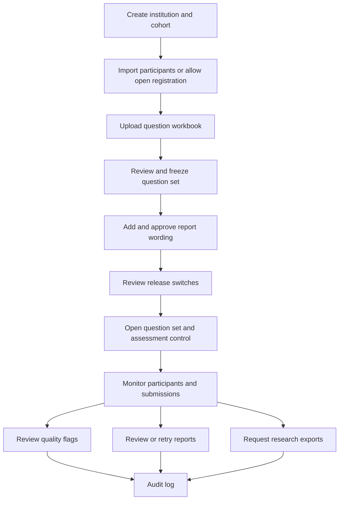

The recommended order matters. Enabling `pilotS2` before approved wording exists can produce correctly scored attempts whose reports fail closed with `WORDING_MISSING`.

## 18. Repository map

```text
Santulan/
|-- frontend/                     React browser application
|   |-- src/App.js                Frontend routes
|   |-- src/pages/                Public, participant, and admin pages
|   |-- src/components/           Shared UI components
|   |-- src/services/             Session and API client
|   `-- src/styles/               Shared styles and design tokens
|
|-- backend/                      Node.js and Express application
|   |-- src/server.js             Process startup and workers
|   |-- src/app.js                Express application
|   |-- src/routes/               API route table
|   |-- src/controllers/          HTTP input and output
|   |-- src/services/             Business workflows and domain rules
|   |-- src/models/               Repositories, schema, and scoped database access
|   |-- src/jobs/workers/         Background workers
|   |-- db/migrations/            Forward-only database migrations
|   |-- scripts/                  Operational commands
|   |-- seeders/                  Development/reference seeders
|   `-- tests/santulan/           Backend test suites
|
|-- docs/                         Source documents, workbooks, and UI references
|-- specs/                        Implemented contracts and evidence
|-- docker-compose.yml            Full Docker stack
|-- README.md                     Setup and command reference
|-- backend.md                    Detailed backend explanation
|-- database.md                   Detailed database explanation
`-- FLOWCHART.md                  This onboarding map
```

## 19. Running the project

### Local development

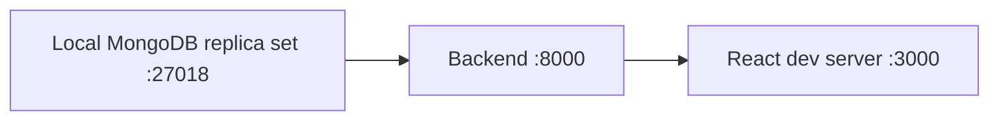

Database and backend:

```bash
cd backend
npm install
npm run db:local:init -- --write-env
npm run db:migrate
npm run db:seed:reference
npm run db:seed:dev
npm run dev
```

Frontend in another terminal:

```bash
cd frontend
npm install
npm start
```

Health check:

```text
GET http://localhost:8000/api/v1/health
```

A healthy response is:

```json
{ "store": "ok" }
```

### Docker alternative

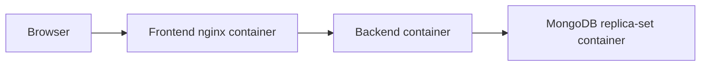

```bash
cp .env.example .env
./docker.sh start
./docker.sh seed-dev
```

The default published ports are frontend `3000` and backend `8000`. `FRONTEND_PORT` and `BACKEND_PORT` in the root `.env` can change the host ports when local development is already using them.

## 20. Tests

Backend:

```bash
cd backend
npm run test:santulan
```

Frontend:

```bash
cd frontend
npm test
npm run check:contrast
npm run build
```

Backend tests use a scratch database such as `santulan_qual`, not the development database. The database name must clearly contain `test`, `qual`, or `scratch` before destructive test setup is allowed.

## 21. How to trace a problem

When a page or record is not behaving as expected, trace it in this order:

1. Find the frontend page in `frontend/src/pages`.
2. Find the API function it calls in `frontend/src/services/santulanApi.js`.
3. Find the matching route in `backend/src/routes/v1/santulan.routes.js`.
4. Follow the controller imported by that route.
5. Follow the service called by the controller.
6. Read the related domain rule for allowed states and calculations.
7. Follow repository calls into the scoped store.
8. Check the record state, audit log, response events, and worker logs.

### Example: a report is stuck at `SCORED`

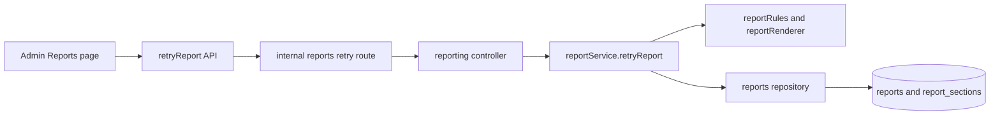

Check:

1. Is `REPORT_WORKER=on`?
2. Does the report row exist?
3. Is it `PENDING` or `FAILED_RETRYABLE`?
4. What is `last_error_code`?
5. If the code is `WORDING_MISSING`, does **Admin > Report wording** contain approved rules for every required domain and layer?
6. After fixing the cause, use the controlled Retry action. Do not manually change the attempt status.

## 22. How to add a feature safely

For a normal backend endpoint:

```mermaid
flowchart LR
    CONTRACT[Confirm contract] --> DOMAIN[Add or update domain rule]
    DOMAIN --> REPO[Add repository operation]
    REPO --> SERVICE[Implement service workflow]
    SERVICE --> CONTROLLER[Add controller]
    CONTROLLER --> ROUTE[Register route and middleware]
    ROUTE --> API[Add frontend API method]
    API --> PAGE[Build or update page]
    PAGE --> TESTS[Add focused tests]
```

Before changing behavior, check `specs/`, `docs/`, existing tests, and the state-machine rules. Do not bypass the scoped store by importing the MongoDB driver directly into a feature service.

## 23. Common questions

### Is this Model-View-Presenter?

No. The backend is closer to layered MVC:

- **View**: React frontend;
- **Controller**: Express controllers;
- **Model/data**: repositories, domain rules, and MongoDB schema;
- **Service layer**: business workflows between controllers and repositories.

There is no separate Presenter layer in the classic MVP sense.

### Why are there many files for one feature?

Each file has one responsibility. HTTP handling, business rules, database access, and security are separated so a change in one area is easier to test and less likely to bypass an important rule.

### Why does the participant sometimes receive `404` instead of a detailed reason?

The backend intentionally avoids revealing whether another participant's record exists. A missing record, an unowned record, and an unreleased report can therefore have the same safe response.

### Why not edit MongoDB manually to fix a state?

Manual edits bypass state machines, transactions, hashes, and audit history. Use the admin UI or the governed service/script designed for that action.

### Why can a report fail after successful scoring?

Scoring calculates results. Reporting combines those results with approved content. They are separate operations, so a report can fail safely without changing valid scores.

## 24. Safety rules a developer must preserve

- Do not accept client-calculated scores or trusted database IDs from request bodies.
- Do not expose another participant's records.
- Do not expose private safeguarding reasons to participants.
- Do not show partial reports.
- Do not invent report wording when approved wording is required.
- Do not silently edit frozen question content.
- Do not delete audit history, scores, or answer history through normal runtime code.
- Do not enable governed behavior merely to make a test record pass.
- Keep related writes in transactions.
- Keep state changes compare-and-set and auditable.

## 25. Recommended reading order

For a new developer:

1. Read this file once from top to bottom.
2. Read [`README.md`](README.md) and run the application.
3. Open [`frontend/src/App.js`](frontend/src/App.js) to understand the screens.
4. Open [`backend/src/routes/v1/santulan.routes.js`](backend/src/routes/v1/santulan.routes.js) to understand the API.
5. Trace one simple request through controller, service, repository, and store.
6. Read [`backend.md`](backend.md) for detailed backend behavior.
7. Read [`database.md`](database.md) when working with stored data.
8. Read the relevant file under [`specs`](specs) before changing governed behavior.

## 26. Final mental model

```mermaid
flowchart TD
    CONTENT[Admin prepares governed questions and wording]
    PERSON[Participant registers and completes consent]
    DELIVERY[Participant completes a frozen questionnaire]
    PIPELINE[Workers validate quality and calculate domain results]
    REPORT[Worker builds an all-or-nothing governed report]
    VIEW[Participant sees only owned and released content]
    RESEARCH[Admin exports de-identified governed research data]

    CONTENT --> DELIVERY
    PERSON --> DELIVERY
    DELIVERY --> PIPELINE
    PIPELINE --> REPORT
    REPORT --> VIEW
    PIPELINE --> RESEARCH
```

The easiest way to understand Santulan is to remember this sentence:

> The frontend asks, the backend decides, MongoDB records, workers continue the pipeline, and governance controls what may be released.
