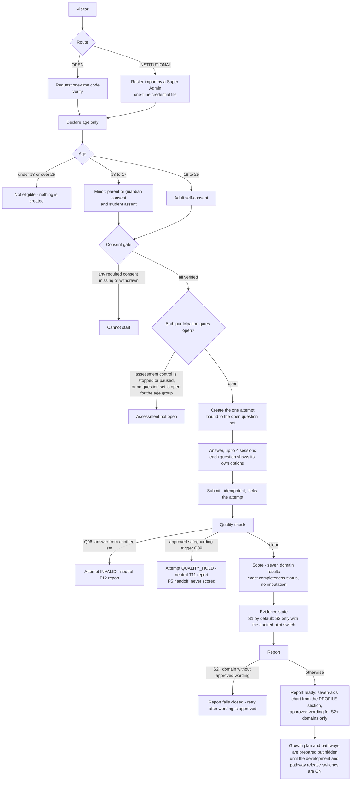
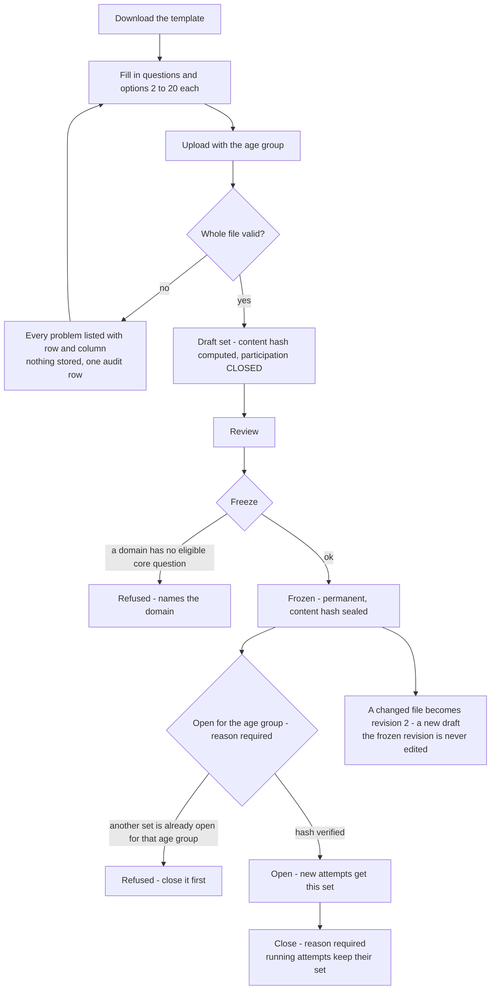

# Santulan flows

Two flows: the **participant journey** and the **question-set lifecycle** an administrator runs to make that journey possible.
Both follow `specs/006-mongodb-question-upload/` (behaviour carried from `specs/005-v3-1-canonical-alignment/`).

## 1. Participant journey

Nothing in the journey shows a participant a raw score outside the released report. There is no score endpoint.

## 2. Question-set lifecycle (Super Admin)

## 3. What gates what

| Gate | Where | Default |
|------|-------|---------|
| Assessment control (OPEN / PAUSED / STOPPED) | latest audit event | OPEN when never changed |
| Question set open for the age group | set `participation_state` | CLOSED |
| Consent gate | consent records | closed until verified |
| `pilotS2` | audited switch | OFF → every domain stays `S1` |
| `advancedEvidence` | audited switch | OFF |
| `developmentRelease` | audited switch | OFF → priorities, actions and growth plans hidden |
| `pathwayRelease` | audited switch | OFF |
| Approved wording | governed loading (`wording-load.js --approve`) | none → S2+ reports fail closed |
