# Santulan Database Guide

MongoDB 8 (replica set, for transactions), no ODM — collections, validators, indexes, roles and research views are all
defined as code in `backend/src/models/schema/`. This document is the map of what exists and why: **27 canonical
collections** (plus 1 development-only credential collection), **9 read-only research views**, and how they relate.

Two tiers appear throughout:

- **Tier A — append-only.** Nobody updates these rows, ever (no credential, no code path has `remove` either — this
  applies to every collection, not just Tier A). History is preserved by inserting a new row, never editing an old one.
- **Tier B — governed change.** Rows can be updated, but only through the specific named mutation the domain rules
  allow (e.g. a consent's `status`, a participant's `status`) — never a free-form update.

---

## 1. Entity-relationship diagram

```mermaid
erDiagram
    INSTITUTIONS ||--o{ INSTITUTIONS : "parent institution of"
    INSTITUTIONS ||--o{ COHORTS : "has"
    INSTITUTIONS |o--o{ PARTICIPANTS : "institutional route only"
    COHORTS |o--o{ PARTICIPANTS : "institutional route only"
    INSTITUTIONS ||--o{ PARTICIPANT_COHORT_HISTORY : "scopes"
    COHORTS ||--o{ PARTICIPANT_COHORT_HISTORY : "scopes"
    PARTICIPANTS ||--o{ PARTICIPANT_COHORT_HISTORY : "moved through"
    ADMIN_USERS |o--o{ PARTICIPANT_COHORT_HISTORY : "assigned by"
    PARTICIPANTS ||--o{ CONSENTS : "gives"

    ASSESSMENT_VERSIONS ||--o{ ITEMS : "contains"
    ASSESSMENT_VERSIONS ||--o{ INTERPRETATION_RULES : "governs"

    PARTICIPANTS ||--o{ ASSESSMENT_ATTEMPTS : "attempts"
    ASSESSMENT_VERSIONS ||--o{ ASSESSMENT_ATTEMPTS : "delivered as"
    ASSESSMENT_ATTEMPTS ||--o{ RESPONSES : "records"
    ITEMS ||--o{ RESPONSES : "answered via"
    ASSESSMENT_ATTEMPTS ||--o{ RESPONSE_EVENTS : "logs"
    ITEMS |o--o{ RESPONSE_EVENTS : "concerns"

    ASSESSMENT_ATTEMPTS ||--o{ QUALITY_FLAGS : "raises"
    ADMIN_USERS |o--o{ QUALITY_FLAGS : "reviewed by"
    ASSESSMENT_ATTEMPTS ||--o{ SCORE_RESULTS : "scored into"
    PARTICIPANTS ||--o{ SCORE_RESULTS : "belongs to"
    ASSESSMENT_VERSIONS ||--o{ SCORE_RESULTS : "scored under"

    PARTICIPANTS ||--o{ REPORTS : "receives"
    ASSESSMENT_ATTEMPTS ||--o{ REPORTS : "generates"
    REPORTS ||--o{ REPORT_SECTIONS : "contains"

    PARTICIPANTS ||--o{ GROWTH_PLANS : "owns"
    ASSESSMENT_ATTEMPTS ||--o{ GROWTH_PLANS : "sourced from"
    ASSESSMENT_VERSIONS ||--o{ GROWTH_PLANS : "built under"
    GROWTH_PLANS ||--o{ GROWTH_PRIORITIES : "ranks"
    GROWTH_PRIORITIES ||--o{ GROWTH_GOALS : "sets"
    GROWTH_GOALS ||--o{ GROWTH_ACTIONS : "suggests"
    GROWTH_GOALS ||--o{ GROWTH_REVIEWS : "reviewed in"

    PARTICIPANTS ||--o{ PATHWAY_DECISIONS : "routed by"
    ASSESSMENT_ATTEMPTS ||--o{ PATHWAY_DECISIONS : "sourced from"
    PATHWAY_DECISIONS ||--o{ PATHWAY_REVIEWS : "reviewed in"
    ADMIN_USERS |o--o{ PATHWAY_REVIEWS : "reviewed by"

    ADMIN_USERS ||--o{ RESEARCH_EXPORTS : "requests"
    ASSESSMENT_VERSIONS ||--o{ RESEARCH_EXPORTS : "sourced from"

    INSTITUTIONS {
        uuid _id PK
        string institution_code
        string institution_name
        string institution_type
        uuid parent_institution_id FK
        string status
        date created_at
        date updated_at
    }
    COHORTS {
        uuid _id PK
        uuid institution_id FK
        string cohort_code
        string cohort_name
        string academic_year
        string developmental_band
        string education_stage
        string status
        date created_at
        date updated_at
    }
    ADMIN_USERS {
        uuid _id PK
        string role
        string auth_provider
        string auth_provider_subject_id
        string status
        date created_at
        date updated_at
    }
    PARTICIPANTS {
        uuid _id PK
        string santulan_id
        string participation_route
        uuid institution_id FK
        uuid cohort_id FK
        string external_student_id
        int age_years_at_registration
        string developmental_band
        string assessment_track
        boolean is_minor
        string administration_language
        string auth_provider
        string auth_provider_subject_id
        string status
        date created_at
        date updated_at
    }
    PARTICIPANT_COHORT_HISTORY {
        uuid _id PK
        uuid participant_id FK
        uuid cohort_id FK
        uuid institution_id FK
        date assigned_at
        date removed_at
        uuid assigned_by FK
        string reason
    }
    CONSENTS {
        uuid _id PK
        uuid participant_id FK
        string consent_type
        string giver_relationship
        string protocol_version
        string verification_method
        date granted_at
        date verified_at
        date withdrawn_at
        string status
        date created_at
    }

    ASSESSMENT_VERSIONS {
        uuid _id PK
        string version_label
        int revision
        string configuration
        int participant_min_age
        int participant_max_age
        string content_hash
        string source_file_hash
        date frozen_at
        string status
        string participation_state
        date created_at
    }
    ITEMS {
        uuid _id PK
        uuid assessment_version_id FK
        string item_code
        string domain_code
        string subdomain_code
        string subdomain_name
        string item_text
        string keying
        string age_band
        string context
        string layer
        string pilot_status
        int display_order
        string status
        string item_content_hash
        date created_at
        array options "[{position, text}], 2-20 options"
    }
    INTERPRETATION_RULES {
        uuid _id PK
        uuid assessment_version_id FK
        string domain_code
        string developmental_band
        string evidence_state
        string locale
        string layer
        string rule_code
        string approved_text_template
        string version
        string status
        date created_at
    }
    DEVELOPMENT_ACTIONS {
        uuid _id PK
        string action_code
        string library_version
        string domain_code
        string subdomain_code
        string progression_level
        string action_text
        string age_band
        string action_type
        int duration_minutes
        string practice_window
        string evidence_status
        object control_flags
        boolean active
        date created_at
    }
    REFLECTION_PROMPTS {
        uuid _id PK
        string prompt_code
        string domain_code
        string subdomain_code
        string prompt_text
        string age_band
        int sequence
        string version
        string status
        date created_at
    }

    ASSESSMENT_ATTEMPTS {
        uuid _id PK
        uuid participant_id FK
        uuid assessment_version_id FK
        int age_years_at_attempt
        string developmental_band_at_attempt
        string status
        int session_count "0-4"
        date created_at
        date started_at
        date submitted_at
        date completed_at
        date last_activity_at
        string scoring_version
        int lock_version
    }
    RESPONSES {
        uuid _id PK
        uuid attempt_id FK
        uuid item_id FK
        string response_value "chosen option's position, as text"
        int response_version
        boolean is_current
        uuid supersedes_response_id
        int response_time_ms
        int presented_order
        date answered_at
        string idempotency_key
    }
    RESPONSE_EVENTS {
        uuid _id PK
        uuid attempt_id FK
        uuid item_id FK
        string event_type
        int session_number
        date occurred_at
        object metadata
    }

    QUALITY_FLAGS {
        uuid _id PK
        uuid attempt_id FK
        string domain_code
        string flag_code "Q01-Q09"
        string severity
        date detected_at
        string disposition
        uuid reviewed_by FK
        date reviewed_at
        string review_note
    }
    SCORE_RESULTS {
        uuid _id PK
        uuid attempt_id FK
        uuid participant_id FK
        uuid assessment_version_id FK
        string domain_code
        number raw_score "1-5, null if INSUFFICIENT"
        number completeness_rate
        int eligible_items
        int valid_items
        string completeness_status
        string score_status "evidence state S0-S5/SH"
        string scoring_version
        date calculated_at
    }

    REPORTS {
        uuid _id PK
        uuid participant_id FK
        uuid attempt_id FK
        string report_version
        string report_type
        string generation_status
        int retry_count
        date generated_at
        string last_error_code
        date last_error_at
        string content_hash
        date created_at
    }
    REPORT_SECTIONS {
        uuid _id PK
        uuid report_id FK
        string section_type
        boolean is_released_to_participant
        string domain_code
        string content_version
        string locale
        int display_order
        string content_snapshot
        date created_at
    }
    GROWTH_PLANS {
        uuid _id PK
        uuid participant_id FK
        uuid source_attempt_id FK
        uuid assessment_version_id FK
        string growth_plan_version
        string status
        date created_at
        date updated_at
    }
    GROWTH_PRIORITIES {
        uuid _id PK
        uuid plan_id FK
        string domain_code
        int candidate_rank
        boolean participant_selected
        string priority_text
        date created_at
    }
    GROWTH_GOALS {
        uuid _id PK
        uuid priority_id FK
        string goal_text
        string cue
        string response
        string fallback_action
        string frequency
        string review_date
        string status
        date created_at
        date updated_at
    }
    GROWTH_ACTIONS {
        uuid _id PK
        uuid goal_id FK
        string action_code
        string action_version
        string action_text
        date created_at
    }
    GROWTH_REVIEWS {
        uuid _id PK
        uuid goal_id FK
        string review_date
        string what_happened
        string barrier
        string learning
        string adjustment
        string evidence_note
        string next_step
        date created_at
    }
    PATHWAY_DECISIONS {
        uuid _id PK
        uuid participant_id FK
        uuid source_attempt_id FK
        string domain_code
        string pathway_code
        string trigger_code
        string evidence_state
        string decision_source
        string decision_reason
        string status
        date created_at
        string review_due
        string policy_version
        string pathway_engine_version
    }
    PATHWAY_REVIEWS {
        uuid _id PK
        uuid pathway_decision_id FK
        string outcome
        string evidence_note
        string support_change
        string next_step
        uuid reviewed_by FK
        date reviewed_at
    }

    RESEARCH_EXPORTS {
        uuid _id PK
        uuid requested_by FK
        object filters
        string anonymisation_version
        uuid source_assessment_version_id FK
        date created_at
        string status
        string file_reference
        date completed_at
    }
    AUDIT_LOGS {
        uuid _id PK
        string actor_type "PARTICIPANT | ADMIN | SYSTEM"
        uuid actor_id "polymorphic, no FK constraint"
        string action_type
        string target_entity "polymorphic, names any collection"
        uuid target_id "polymorphic, no FK constraint"
        object previous_state
        object new_state
        string reason
        date occurred_at
        string correlation_id
    }
```

**Not shown as a relationship line:** `audit_logs` can reference *any* collection (`target_entity` names it, `target_id`
points at it) and *any* actor type (`actor_type` says which) — it's intentionally polymorphic, so drawing a line to
every entity would just add clutter. Read it as: every collection above can have audit rows pointing at it.

**Not shown at all:** `dev_identity_credentials` (development only, matched to a participant/admin at the application
layer by `provider` + `subject_id`, not a real foreign key — it's outside the 27 canonical collections and never
present in production).

---

## 2. Which collection is used for what

### Identity, organisations and consent

| Collection | Tier | Used for |
|---|---|---|
| `institutions` | B | Schools/colleges/universities taking part. Self-referencing (`parent_institution_id`) for a parent/branch structure. |
| `cohorts` | B | A group within an institution (a class or year group) that a roster import registers participants into. |
| `admin_users` | B | Super Admin (and reserved future admin role) accounts. Only `ACTIVE` + `SUPER_ADMIN` can currently act (pilot-role control). |
| `participants` | B | The core participant identity: opaque `santulan_id`, age-derived fields (`developmental_band`, `assessment_track`, `is_minor` — all computed from age, never set directly), OPEN vs INSTITUTIONAL route, optional auth credential. **No name, no contact details, ever.** |
| `participant_cohort_history` | A | Append-only record of which cohort a participant was in and when — a full move history, not just the current cohort. |
| `consents` | B | One row per consent (adult self-consent, or minor's student assent + parent/guardian consent). Drives the "can this participant start an attempt" gate. |

### Assessment content (the question bank)

| Collection | Tier | Used for |
|---|---|---|
| `assessment_versions` | B | A frozen/open question set for one age configuration (ADOLESCENT or EMERGING_ADULT). Lifecycle: DRAFT → FROZEN → OPEN → CLOSED. Carries the `content_hash` that gets re-verified on open and at server start-up. |
| `items` | A | The actual questions, each with 2-20 embedded answer `options` (`{position, text}`). Never updated once inserted — a content fix is a new version, not an edit. |
| `interpretation_rules` | B | Approved wording templates used to interpret a domain's evidence state into report text. |
| `development_actions` | B | The library of suggested growth actions per domain/subdomain, offered when building a growth plan. |
| `reflection_prompts` | B | Prompt text shown alongside growth reviews. |

### Assessment delivery (taking the assessment)

| Collection | Tier | Used for |
|---|---|---|
| `assessment_attempts` | B | One attempt at one assessment version: state machine (`CREATED → IN_PROGRESS → PAUSED ⇄ IN_PROGRESS → SUBMITTED → SCORING → SCORED`, plus `QUALITY_HOLD`/`INVALID`/`EXPIRED`), session count (max 4). |
| `responses` | B | Every answer, versioned — a re-answer inserts a new version and retires the old one (`is_current`), never edits in place. `response_value` is the chosen option's **position**, never a score. |
| `response_events` | A | Append-only interaction log: session start/end, pause, resume, submit, quality-check-completed. The audit trail of *what happened during* an attempt, distinct from `audit_logs` (which is *administrative* actions). |

### Quality and scoring

| Collection | Tier | Used for |
|---|---|---|
| `quality_flags` | B | Q01-Q09 flags raised against an attempt (or one of its domains). Q09 (safeguarding) is always `CRITICAL` and is deliberately excluded from every research view and the general admin submission view — it only surfaces in the restricted quality-review flow. |
| `score_results` | A | One row per domain per attempt: raw score (or `null` if `INSUFFICIENT`), exact-integer completeness status, and the evidence state (`S0`-`S5`/`SH`) that governs how much of the score can be shown or exported. Insert-only — a rescore is a new row under a new `scoring_version`, never an edit. |

### Reports, growth and pathways

| Collection | Tier | Used for |
|---|---|---|
| `reports` | B | One report shell per attempt; `generation_status` tracks `PENDING → REPORT_READY` (or `UNDER_REVIEW`/`NOT_ELIGIBLE`/`FAILED_RETRYABLE`). A terminal report always carries a `content_hash`; a pending/failed one never does. |
| `report_sections` | B | The actual rendered content, one row per section, each flagged whether it's released to the participant. |
| `growth_plans` | B | A participant's growth plan, built from one source attempt. |
| `growth_priorities` | B | Up to 3 domains a participant selects to focus on within their plan. |
| `growth_goals` | B | An "If-Then" goal (cue/response/fallback) set under one priority. |
| `growth_actions` | B | A suggested action attached to a goal (drawn from `development_actions`). |
| `growth_reviews` | A | Append-only journal entries reviewing progress on a goal. |
| `pathway_decisions` | A | Routing/support decisions (e.g. escalation) triggered off an attempt — insert-only, so the decision history is never rewritten. |
| `pathway_reviews` | A | Follow-up review of a pathway decision's outcome. |

### Research and audit

| Collection | Tier | Used for |
|---|---|---|
| `research_exports` | B | A requested anonymised research export job: `REQUESTED → GENERATING → READY`/`FAILED`, with the filters used and a pointer to the generated file. |
| `audit_logs` | A | The system-wide administrative audit trail — every governed mutation (and now some sensitive reads, like a Super Admin viewing a participant's raw answers) writes one row here, usually in the same transaction as the change it's recording. Polymorphic: `actor_type`/`actor_id` say who, `target_entity`/`target_id` say what was affected. |
| `dev_identity_credentials` | B (dev only) | **Not one of the 27 canonical collections.** Bcrypt password hashes for the local/dev identity provider only; a production deployment uses a real managed identity provider and never touches this collection. |

---

## 3. Research views (read-only, 9 total)

Built by migrations, not by application code. None ever expose `participant_id` (the internal `_id`), auth fields or
contact details — identity leaves only as the opaque `santulan_id`. Consumed by the research-export pipeline
(`services/research/exportService.js`), not by any admin UI page directly.

| View | Reads from | Purpose |
|---|---|---|
| `v_research_participants` | `participants` | De-identified participant roster with institution/cohort codes. |
| `v_research_attempts` | `assessment_attempts` | Attempt-level facts (status, session count, timestamps) per participant. |
| `v_research_item_responses` | `responses` | Per-item answers, joined to the item code — the row-level dataset behind a research export. |
| `v_research_domain_scores` | `score_results` | Domain-level scores and completeness. |
| `v_research_quality_flags` | `quality_flags` | Q01-Q08 only — **Q09 never leaves this view.** |
| `v_research_response_events` | `response_events` | The interaction log, with the idempotency key stripped from `metadata`. |
| `v_research_assessment_versions` | `assessment_versions` | Version/revision/status reference data. |
| `v_research_cohorts` | `cohorts` | Cohort reference data with institution codes. |
| `v_candidate_subdomain_scores` | `responses` | **Research-only, not granted to the runtime credential at all** (migrator-only). A candidate subdomain-level mean, computed on the fly — offered as an alternative data point, not the governed score. |

---

## 4. How to read the diagram

- `||--o{` means "exactly one parent, zero or more children" (a required foreign key).
- `|o--o{` means the same, but the foreign key is **nullable** — e.g. a `participants` row only has an `institution_id`
  when its `participation_route` is `INSTITUTIONAL`; an OPEN participant has neither.
- Every `_id` is a UUID string (no auto-incrementing numeric ids anywhere).
- Full validator detail (enum value lists, `$expr` consistency rules, exact field constraints) lives in
  `backend/src/models/schema/collections/*.js` — this document is the map, not a restatement of every rule; the
  matching test file (`backend/tests/santulan/store/validators.*.test.js`) is the executable source of truth.
