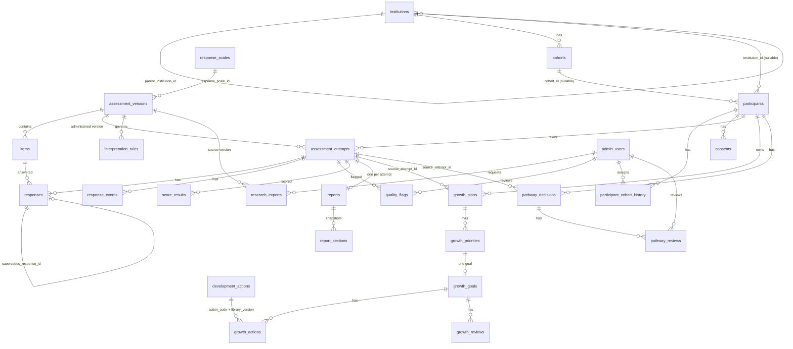

# Data Model: v3.1 Canonical Alignment (005)

**Branch**: `005-v3-1-canonical-alignment` | **Date**: 2026-09-19 | **Plan**: [plan.md](plan.md) | **Research**: [research.md](research.md)

The authoritative physical definition of every column is **BUILD 01 §6** (`Santulan_BUILD_01_Canonical_Database_Contract_PostgreSQL_v3_1.docx`, sections 6.1–6.28). This document does **not** restate columns; it gives the entity map, relationships, state machines, derived/generated values, database objects, enum sets, seeds and the mapping to the legacy data. Where a value is not stated in the on-disk contracts it is marked **ASSUMED (D-11)**.

## 1. Entity map (28 tables, schema `santulan`)



Not in the diagram (no foreign keys by design): `reflection_prompts` (content library), `audit_logs` (append-only, keyed by `target_entity` + `target_id`).

| Group | Tables | Notes |
|-------|--------|-------|
| Identity & organisation | `institutions`, `cohorts`, `participants`, `participant_cohort_history`, `admin_users`, `consents` | `participants` holds **no** name/email/phone/DOB/address/guardian/government ID |
| Content & configuration | `response_scales`, `assessment_versions`, `items`, `interpretation_rules`, `development_actions`, `reflection_prompts` | Frozen after release; `item_code` unique **per version** |
| Delivery | `assessment_attempts`, `responses`, `response_events` | Append-only responses; sessions are events, not a table |
| Quality, scoring, reporting | `quality_flags`, `score_results`, `reports`, `report_sections` | Immutable scores and snapshots |
| Growth & pathways | `growth_plans`, `growth_priorities`, `growth_goals`, `growth_actions`, `growth_reviews`, `pathway_decisions`, `pathway_reviews` | `growth_actions` → `development_actions(action_code, library_version)` composite FK |
| Research & audit | `research_exports`, `audit_logs` | `audit_logs` doubles as idempotency and control-plane store (R-04, R-18) |

**Delete behaviour**: `RESTRICT` on identity, assessment, response, score and lineage foreign keys; `CASCADE` only for `report_sections`, `growth_priorities`, `growth_goals`, `growth_actions`, `growth_reviews`, `pathway_reviews`; `SET NULL` on `reviewed_by` / `assigned_by`. Institutions and cohorts are archived by status, never deleted.

## 2. Keys, generated columns and derived values

| Item | Rule |
|------|------|
| Primary keys | `uuid DEFAULT gen_random_uuid()` (`pgcrypto`); human-facing codes stored separately (`santulan_id`, `institution_code`, `item_code`, `action_code`, `prompt_code`) |
| `participants.developmental_band` | generated: `resolve_developmental_band(age_years_at_registration)` — D1 13–15, D2 16–17, D3 18–20, D4 21–25 (technical strata only) |
| `participants.assessment_track` | generated: `resolve_assessment_track(age)` — 13–17 `ADOLESCENT`, 18–25 `EMERGING_ADULT` |
| `participants.is_minor` | generated: `age_years_at_registration < 18` |
| `assessment_attempts.developmental_band_at_attempt` | generated from `age_years_at_attempt` |
| Attempt version | `assessment_version_id` and `age_years_at_attempt` stored on the attempt; never inferred from current age |
| Item identity | `(assessment_version_id, item_code)` and `(assessment_version_id, display_order)` unique; `item_id` derived (D-08) |
| Score identity | unique `(attempt_id, domain_code, scoring_version)`; exactly 7 rows per attempt/version |
| Report identity | `reports.attempt_id` unique (one per attempt); `report_sections` unique `(report_id, display_order)` |

## 3. State machines

### 3.1 Consent (`consents.status`)

```text
PENDING ──grant──▶ GRANTED ──verify──▶ VERIFIED
   │                  │                   │
   └──────────────────┴───────withdraw────┴──▶ WITHDRAWN (terminal)
```

Forbidden: `PENDING→VERIFIED`, anything out of `WITHDRAWN`. `VERIFIED` requires `verified_at ≥ granted_at` and a non-blank `verification_method`. One non-withdrawn row per participant/type/protocol; one `VERIFIED` per participant/type/protocol.

### 3.2 Assessment attempt (`assessment_attempts.status`)

```text
CREATED ─▶ STARTED ─▶ IN_PROGRESS ◀─▶ PAUSED ─▶ SUBMITTED ─▶ SCORING ─▶ SCORED ─▶ REPORT_READY
              (IN_PROGRESS / PAUSED / STARTED)──submit──▶ SUBMITTED
   QUALITY_HOLD · INVALID · EXPIRED  (controlled exceptions per transition matrix)
```

Allowed transitions (BUILD 05 workbook `01_STATE_MACHINE`): `CREATED → STARTED | EXPIRED | INVALID`; `STARTED → IN_PROGRESS | PAUSED | SUBMITTED | QUALITY_HOLD | INVALID | EXPIRED`; `IN_PROGRESS → PAUSED | SUBMITTED | QUALITY_HOLD | INVALID | EXPIRED`; `PAUSED → IN_PROGRESS | SUBMITTED | QUALITY_HOLD | INVALID | EXPIRED`; `SUBMITTED → SCORING | QUALITY_HOLD | INVALID`; `SCORING → SCORED | QUALITY_HOLD | INVALID`; `SCORED → REPORT_READY | QUALITY_HOLD | INVALID`; `QUALITY_HOLD → SCORING | SCORED | INVALID | EXPIRED`. Non-terminal (for the one-attempt index) = everything except `REPORT_READY`, `INVALID`, `EXPIRED`. `session_count` 0–4; increments only on a true session boundary.

### 3.3 Response chain

Version *n* inserts with `response_version = n`, `supersedes_response_id` = version *n−1*, `is_current = true`, and flips the prior row's `is_current` to false (the only permitted mutation). Exactly one `is_current` per `(attempt_id, item_id)`. No update/delete of `response_value` ever.

### 3.4 Report generation (`reports.generation_status`)

```text
PENDING ─▶ REPORT_READY                (attempt SCORED ─▶ REPORT_READY, same transaction)
PENDING ─▶ FAILED_RETRYABLE ─retry─▶ PENDING   (retry_count + 1; attempt stays SCORED)
QUALITY_HOLD attempt ─▶ UNDER_REVIEW (T11)      INVALID attempt ─▶ NOT_ELIGIBLE (T12)
```

### 3.5 Research export (`research_exports.status`)

`REQUESTED → GENERATING → READY | FAILED` (`REQUESTED` may also fail). One terminal state; `READY` only after the file is stored; download only from `READY`.

### 3.6 Release and control

| Control | Where | Default |
|---------|-------|---------|
| Content freeze | `response_scales.status`, `assessment_versions.status` = `DRAFT → FROZEN` | `DRAFT` |
| Participation release | `assessment_versions.participation_state` (`CLOSED` … `OPEN`; also `PAUSED`/`STOPPED` per BUILD 02 §15) | `CLOSED` |
| Control plane | latest `audit_logs` row `PARTICIPATION_CONTROL` (R-18) | no row ⇒ `OPEN` |
| Advanced evidence | GUC `app.allow_advanced_evidence_states` | off |
| Prescriptive sections | `report_sections.is_released_to_participant` (PRIORITY/ACTION additionally gated by a development release gate) | `false` |

## 4. Validation rules by entity (from the contract)

| Entity | Rules |
|--------|-------|
| `participants` | age 13–25 check; `participant_institutional_scope_ck` (INSTITUTIONAL ⇒ institution + cohort); `participant_open_scope_ck` (OPEN ⇒ none; BUILD 03); `participant_auth_pair_ck` (all-or-none); unique auth pair (partial); unique `(institution_id, external_student_id)` (partial); cohort's institution must equal the participant's (trigger) |
| `consents` | type/giver/age compatibility; timestamp order checks; transition trigger; non-blank `protocol_version`; VERIFIED needs method (BUILD 04) |
| `assessment_versions` | age range 13–25; `ADOLESCENT` ⇒ 13–17, `EMERGING_ADULT` ⇒ 18–25; `FROZEN` ⇒ `frozen_at`; immutable after `FROZEN` |
| `items` | valid domain/subdomain and membership; `age_band ∈ {13–17, 18–25, 13–25}`; `context ∈ {General, School, College/Work, Digital}`; `layer` default `CORE`; `display_order > 0`; immutable after freeze |
| `assessment_attempts` | `age_years_at_attempt` matches the version's range; consent gate, ACTIVE participant, `FROZEN` version and scale, `participation_state = OPEN` at insert (trigger); `session_count` 0–4 |
| `responses` | item belongs to the attempt's version; item `CORE` and ACTIVE; value inside the frozen scale; contiguous version chain; nonblank unique `idempotency_key`; blocked once attempt ≥ `SUBMITTED`; UPDATE/DELETE of content blocked for every role |
| `response_events` | `session_number` 1–4 and ≤ the attempt's `session_count`; unique submission-key per attempt (partial expression index) |
| `quality_flags` | unique attempt/domain/code; `Q09 ⇒ CRITICAL`; reviewer pair all-or-none; detection facts immutable |
| `score_results` | `raw_score` 1.00–5.00 or NULL; `completeness_rate` 0–1; participant + version must match the attempt; immutable; `< 60 %` completeness ⇒ NULL score; `≤ 80 %` ⇒ no S2+; S3–S5 need the release gate |
| `reports` / `report_sections` | report participant = attempt's; `REPORT_READY` requires attempt `SCORED`; snapshot columns immutable except `is_released_to_participant`; released only when report ready; PRIORITY/ACTION need the development gate |
| `growth_*` | plan participant/version = source attempt's; ≤ 3 `participant_selected` priorities per plan; priority domain must be reportable (S2–S5, not held); action FK to the library |
| `pathway_decisions` | participant = source attempt's; P3/P4 with `SCORE_ONLY`/`LOW_SCORE` trigger rejected; ordinary routes rejected for QUALITY_HOLD/INVALID; P5 only from Q09/safeguarding/crisis triggers; `status ∈ S0…S7` (contract text) |
| `admin_users` | unique `(auth_provider, auth_provider_subject_id)`; ACTIVE ⇒ role `SUPER_ADMIN` (pilot trigger) |
| `audit_logs` | INSERT only; UPDATE/DELETE rejected for every role |

## 5. Database objects beyond the tables

| Kind | Objects (source) |
|------|------------------|
| Helper functions | `resolve_assessment_track`, `resolve_developmental_band`, `valid_domain_code`, `valid_subdomain_code`, `subdomain_belongs_to_domain`, `participant_has_required_consent` (BUILD 01) |
| Registration / consent | `build03_resolve_registration(age)`, `build03_assert_catalog_route(age)`, `build04_consent_gate(uuid)`, `validate_consent_row()` (BUILD 03/04) |
| Delivery procedures (`SECURITY DEFINER`, `PUBLIC` revoked) | `save_response(attempt,item,value,time,order,idempotency)`, `begin_or_resume_session(attempt)`, `pause_session(attempt,reason)`, `submit_attempt(uuid,text)` — the legacy `submit_attempt(uuid)` is dropped (BUILD 05) |
| Scoring / quality | quality-complete prerequisite, Q06 detector, server-only `score_attempt(attempt, scoring_version)`, research-only subdomain view (`security_invoker`, revoked from `PUBLIC`) (BUILD 06) |
| Reporting | begin/complete/fail/retry functions, participant release view, priority guard, pathway guard, `build07_fire_p5(...)` (BUILD 07) |
| Admin / research | pilot admin-role trigger, response and audit mutation triggers, research-safe views, export request/claim/complete/fail/download functions, admin audit helper (BUILD 08) |
| Indexes | the 29 listed in BUILD 01 §8 — **no additions** without the user's approval |
| RLS | `ENABLE` + `FORCE` on participant/tenant-derived tables; policies named in BUILD 01 §9; `santulan.ctx_*()` context functions (R-03) |

## 6. Enumerated value sets

| Enum | Values | Source |
|------|--------|--------|
| `participation_route` | `OPEN`, `INSTITUTIONAL` | BUILD 03 |
| `assessment_track` | `ADOLESCENT`, `EMERGING_ADULT` | BUILD 01 |
| `developmental_band` | `D1`, `D2`, `D3`, `D4` | BUILD 01 §3.2 |
| `consent_type` | `PARENT_GUARDIAN_CONSENT`, `STUDENT_ASSENT`, `ADULT_SELF_CONSENT` | BUILD 04 |
| `consent_relationship` | `PARENT`, `GUARDIAN`, `SELF`, `INSTITUTION_DELEGATED` (service-disabled) | BUILD 04 |
| `consent_status` | `PENDING`, `GRANTED`, `VERIFIED`, `WITHDRAWN` | BUILD 01 §5.1 |
| `evidence_state` | `S0`…`S5`, `SH` | BUILD 01 §5.3 |
| `quality_flag_code` | `Q01`…`Q09` | BUILD 01 §5.4 |
| `attempt_status` | as §3.2 | BUILD 01 §5.2 |
| `item_keying` | `POSITIVE`, `REVERSE` | BUILD 02 §8 |
| `item_layer` | `CORE` (active), `V`, `SJT`, `O` (reserved) | BUILD 00 |
| `pathway_code` | `P1`…`P5` | BUILD 07 |
| `admin_role` | `SUPER_ADMIN`, `INSTITUTION_ADMIN`, `RESEARCH_OPERATOR` | BUILD 08 |
| `research_export_status` | `REQUESTED`, `GENERATING`, `READY`, `FAILED` | BUILD 08 |
| `report_generation_status` | `PENDING`, `REPORT_READY`, `FAILED_RETRYABLE`, `UNDER_REVIEW`, `NOT_ELIGIBLE` | BUILD 07 |
| `report_section_type` | `PROFILE`, `MEANING`, `PATTERN`, `STRENGTH`, `GROWTH`, `PRIORITY`, `ACTION`, `CHANGE`, `UNDER_REVIEW`, `NOT_ELIGIBLE` | BUILD 07 |
| `response_event_type` | `SESSION_START`, `SESSION_END`, `PAUSE`, `RESUME`, `RESPONSE_SAVED`, `SUBMIT`, `QUALITY_CHECK_COMPLETED`, report-retry / processing events | BUILD 05–07 (complete list ASSUMED) |
| `assessment_participation_state` | `CLOSED`, `OPEN`, `PAUSED`, `STOPPED` | BUILD 01/02 (ASSUMED complete) |
| `content_status`, `controlled_content_status` | `DRAFT`, `FROZEN` / `DRAFT`, approved value(s) | ASSUMED (D-11) |
| `quality_severity`, `quality_disposition` | `CRITICAL` + others; default `UNREVIEWED` | ASSUMED (D-11) |
| `progression_level` | `Foundation`, `Practice`, `Transfer` | BUILD 07 |
| `institution_type` / `_status`, `cohort_status`, `participant_status`, `admin_status`, `growth_*_status`, `pathway_decision_source`, `pathway_review_outcome`, `audit_actor_type` | minimal implied sets | ASSUMED (D-11) |

## 7. Seed and reference data (fail-closed)

| Seed | Rows | State |
|------|------|-------|
| `response_scales` | 1 — `santulan-capability-frequency-5pt-candidate-v3.1` (anchors 1 Almost never · 2 Rarely · 3 Sometimes · 4 Often · 5 Almost always; keying definition; content hash) | `DRAFT` |
| `assessment_versions` | 2 — UUIDs `d6c8be95-…` (adolescent, 13–17) and `f88a7bf0-…` (emerging adult, 18–25) | `DRAFT` / `CLOSED` |
| `items` | 175 + 171 | ACTIVE, CORE, POSITIVE |
| `development_actions` | 216 (72 subdomains × 3 levels), source: Development Reporting Master sheet `07_Development_Action_Library` | `active = false` |
| `reflection_prompts` | 72 (one per subdomain) | `DRAFT` |
| `interpretation_rules` | 0 | — |

## 8. Non-table state (configuration, not schema)

| Config | Purpose | Default |
|--------|---------|---------|
| `quality_policy` (versioned JSON) | enabled detectors, thresholds, outcome rules | Q06 only (R-10) |
| `evidence_config` (versioned JSON) | evidence state per version × domain | absent ⇒ `S1` |
| Approved consent protocols | `protocol_version` → immutable content + allowed verification methods | none ⇒ consent creation fails closed |
| Idempotency / control-plane state | rows in `audit_logs` (R-04, R-18) | — |
| Export storage | `EXPORT_DIR` / object-storage adapter | local protected dir (dev) |

## 9. Legacy → canonical relationship

| Legacy (feature 002/004) | Canonical | Handling |
|--------------------------|-----------|----------|
| `accounts` (student / superuser) | `participants` / `admin_users` | bridged by `auth_provider` + subject (R-07); no data copied |
| `participant_profiles` | `participants` | not migrated; new registrations only |
| `assessment_versions` (`is_active`, v1.0) | `santulan.assessment_versions` | separate; v1.0 versions remain read-only |
| `assessment_attempts`, `responses`, `response_events`, `quality_flags`, `score_results`, `reports`, `report_sections` (public schema) | same-named `santulan.*` | separate stores; legacy frozen after cutover, never dropped without a request |
| `content_import_records`, participation-control tables | catalog reconcile receipts, `audit_logs` control rows | replaced by R-18 and the reconcile receipt |
| Feature-004 tables (`schools`, `scp_*`, …) | — | untouched |
