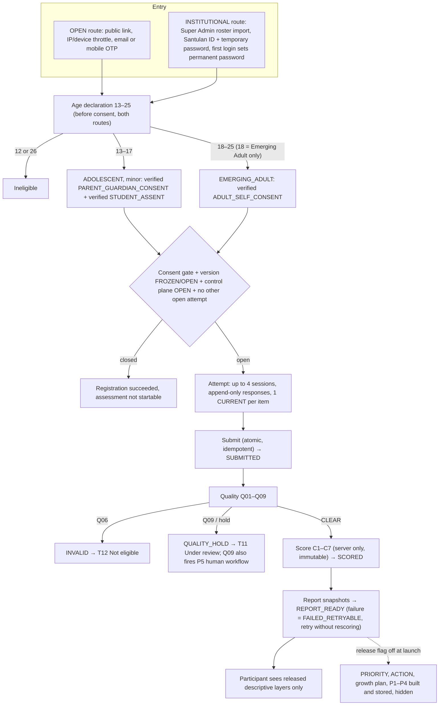

# Feature Specification: v3.1 Canonical Alignment

**Feature Branch**: `005-v3-1-canonical-alignment`

**Created**: 2026-09-19

**Revised**: 2026-09-19 (full re-read of `docs/Santulan 2.0/` — every BUILD document, audit workbook, manifest, source workbook, diagram and UI screen)

**Status**: Draft (revised) — spec only; plan, tasks and implementation are not generated for this revision

**Input**: Align the delivered Santulan product to the SanTulan 2.0 build-program documentation under `docs/Santulan 2.0/` — canonical `santulan` schema (28 tables), v3.1 assessment catalog and version labels, DRAFT/CLOSED release defaults, remapped C4/C5 construct codes, age routing 13–17 / 18–25 (age 18 → Emerging Adult), consent/verification gate, delivery/scoring/reporting/admin/research engines, security/QA/launch qualification, and the participant-facing visual design taken from `UI screen Samples/`. *Revision request*: "read the specs and update it according to docs/santulan — read all the files and images … there is the frontend design also … for current time only edit or make the specs."

## Source of Truth

Everything below was read in full for this revision. Where documents disagree the **conflict rule** applies (BUILD 00 §2): item wording comes from the frozen item files, construct identity from Foundation 2.0 as restated in BUILD 00 v3.1, database behaviour from the BUILD 01 contract, and no one "fixes" a construct, score meaning, consent rule or safety rule in application code without a change record.

| Authority | Files (under `docs/Santulan 2.0/` unless noted) | Used for |
|-----------|--------------------------------------------------|----------|
| **Engineering contracts (authoritative)** | `BUILD_00…BUILD_09` `.docx` contracts, their `*_Release_Manifest_*.json` / `*_Audit_*.xlsx`, `BUILD_00_Baseline_Lock_v3_1.json`, `BUILD_01_DB_Contract_v3_1.json`, `RELEASE_01` execution-control workbook and runbook | Every requirement below. Document IDs and titles win over folder names |
| **Item data** | `BUILD_02 … Assessment_Catalog_and_Item_Audit_v3_1.xlsx` (sheets `03_ADOL_CANONICAL`, `04_EA_CANONICAL` = the 175 + 171 v3.1 rows); `Santulan_Adolescent_Items_TECH_READY_v3_0.xlsx`, `Santulan_EmergingAdult_Items_TECH_READY_v3_0.xlsx`; `Santulan_PILOT_READY_Item_Pool_v3_0.xlsx` (222-row audit reference only) | US1 |
| **Still-authoritative source workbooks** (BUILD 00 authority order #6–7) | `docs/Santulan_Pilot_1_2_MASTER_and_Final_ERD.xlsx`, `docs/Santulan_Development_Reporting_MASTER_System_v1_1.xlsx` | API/participation/security architecture; T01–T12 report templates, 216-action library, P1–P5 pathways |
| **Reference images** | `Final.jpeg` (system architecture), `image.png` (ERD poster), `docs/WhatsApp Image 2026-09-15 at 8.48.25 AM.jpeg` (Pilot 1.2 flow chart), `UI screen Samples/` (25 screens) | Flows and visual design (US10) |
| **Sample institutional roster** | `docs/Creative Minds Global School- required Students Info_014006.xlsx` | Realistic bulk-import edge cases (US4) |
| **Superseded — do not use for v3.1** | `docs/Santulan_*_Items_TECH_READY.xlsx` (v1.x), `docs/Santulan_*_Assessment_OFFLINE.docx` (state age range 13–18), `docs/MCQ_Template.csv`, `docs/SQL-Database-Schema.md` (the feature-004 school/student platform schema — a *different* database, kept as-is) | History only |

### Known discrepancies between the documents (recorded, not silently resolved)

1. **Folder names vs document IDs.** Folders `BUILD_04_Assessment_Delivery_Engine`, `BUILD_05_Scoring_and_Quality_Engine`, `BUILD_06_Development_Action_and_Pathway_Engine` hold, respectively, BUILD 04 *Consent, Assent & Verification Gate*, BUILD 05 *Assessment Delivery Engine*, BUILD 06 *Scoring & Quality Engine*. This spec uses the document IDs.
2. **The ERD poster (`image.png`) is not the locked entity list.** It shows 28 entities but only 16 match the locked BUILD 00/01 list; it adds `identities`, `assessments`, `scale_options`, `goals`, `pathway_assignments`, `pathway_history`, `support_referrals`, `safeguarding_flags`, `users`, `roles`, `reference_data`, `system_settings`, and omits `institutions`, `cohorts`, `participant_cohort_history`, `responses`, `reflection_prompts`, `growth_actions`, `growth_reviews`, `pathway_decisions`, `pathway_reviews`, `research_exports`, `admin_users`. It also shows `first_name`, `last_name`, `date_of_birth` on participants, which BUILD 03 forbids. **BUILD 01 §6 governs.** The poster is illustrative only.
3. **Build numbering in the diagrams.** `Final.jpeg` and `image.png` label engines with different BUILD numbers than the `.docx` contracts (e.g. "Build 05 Scoring & Quality"). The `.docx` IDs govern.
4. **The v3_0 item pools on disk are not the v3.1 catalog.** They differ from the v3.1 canonical rows in exactly **4 rows per form** (subdomain code only): Authenticity items carry `C4.5` (must be `C4.4`) and Autonomy items carry `C4.6` (must be `C4.5`) — audit finding B00-AUD-011. C5 rows are already `C5.1–C5.7`. The literal `…_v3_1.xlsx` files named in the manifests (and their SHA-256 hashes) are **not on disk**.
5. **The SQL/OpenAPI packages are not on disk.** BUILD 01–09 manifests list `*_SQL_Package_*.zip` / OpenAPI files (`000…014_*.sql`, `030…033`, `040…042`, `050…051`, `060…061`, `070…071`, `080…081`, `090…091`), but only the `.docx` contracts, JSON summaries and audit workbooks are present. The contract text is the implementation source; helper names (`build03_resolve_registration`, `build04_consent_gate`, `save_response`, `submit_attempt(uuid,text)`) are taken from it.
6. **Institution types.** BUILD 08 says "University → College/Department"; BUILD 01 §14.2 says only `SCHOOL`/`COLLEGE`/`UNIVERSITY` exist and a `DEPARTMENT` type needs a numbered schema change. BUILD 01 governs; a department is modelled as a `COLLEGE` row with a parent.
7. **The UI samples contradict canonical rules in several places** (date of birth, semantic-looking Santulan IDs, name/photo/location profile, interests/support-needs questionnaires, resources/mentor content, prescriptive "next steps"). Each is reconciled in US10 and in [003 contracts/screen-inventory.md](../003-frontend-visual-design/contracts/screen-inventory.md); the canonical contract wins.

## Corrections made to the previous 005 draft

| Previous draft said | Now |
|---------------------|-----|
| Import v3_0 pools that "already carry C5.1–C5.7 … zero legacy C4.6" | v3_0 pools still carry legacy C4.5/C4.6 in 4 rows per form. Import the v3.1 canonical rows (BUILD 02 workbook) or apply the approved B00-AUD-011 remap by construct identity; nothing else changes |
| UI references at `…/final santulan 2.0 phase by build/UI screen Samples/`, screens `01…26` | Actual path `docs/Santulan 2.0/UI screen Samples/`; **25** screens (`screen 01.png`, `02`–`22`, `24`–`26`; there is no `23`). No admin-console, item-player, report or growth-plan reference screens exist |
| Response-scale anchors "verify against the BUILD 02 catalog workbook" | The workbook holds no anchors. Candidate anchors are in `Santulan_PILOT_READY_Item_Pool_v3_0.xlsx` sheet `03_Response_Scale_and_Scoring` and the OFFLINE booklets: 1 Almost never · 2 Rarely · 3 Sometimes · 4 Often · 5 Almost always. Stays DRAFT until cognitive-testing sign-off |
| Consent folded into registration (one story) | Separate story (US3, BUILD 04, 36 tests): state machine, verification method, protocol version, delegated consent disabled |
| No sign-in / institutional roster / credential story | Added US4 (AT-01–09, AT-27, first-login reset) — the UI has three screens for it |
| No default evidence state | Added: default **S1** ⇒ participants cannot read domain scores until governance authorises S2 (BUILD 01 RLS, BUILD 06 §8) |
| No test counts | Every story lists its BUILD matrix (T03 = 28, T04 = 36, B05 = 45, B06 = 60, B07 = 80, B08 = 84, AT/RC = 44, SEC = 30) |
| "(FR-DEF)" in US1 scenario 4 | Removed (dangling reference) |

## Roles

| Role | Pilot status | What they do |
|------|--------------|--------------|
| Participant — Adolescent (13–17) / Emerging Adult (18–25) | Active | Registers (OPEN or INSTITUTIONAL), passes the consent gate, takes the assessment, views the released report |
| Parent / guardian | No account | Gives verified parent/guardian consent for a minor; verification method is an unfrozen protocol gate |
| Super Admin | **Only active admin role** | Institutions, participants, roster import/credentials, assessment control, monitoring, research exports |
| Institution Admin, Research Operator | Reserved / **inactive** — a DB trigger rejects ACTIVE rows | Deferred (AT-29-DEFERRED) |
| Privileged worker / system | Server-only | Quality, scoring, report generation, export generation, P5 hook; explicit `SYSTEM`/`SERVICE` DB context |

## Reference Flow (from `WhatsApp Image…jpeg`, `Final.jpeg`, BUILD 00 §7)

## User Scenarios & Testing *(mandatory)*

### User Story 1 - Import the v3.1 assessment catalog into the canonical schema (Priority: P1) — BUILD 01 + BUILD 02

An administrator (via a controlled technical role, never a participant credential) loads the two age-band item banks into the canonical `santulan` schema: **`santulan-adolescent-pilot-v3.1`** (13–17, 175 items) and **`santulan-emergingadult-pilot-v3.1`** (18–25, 171 items), each covering exactly 72 canonical subdomains. Both versions land as `DRAFT` with participation `CLOSED`, on the candidate response scale `santulan-capability-frequency-5pt-candidate-v3.1` (also `DRAFT`). The default mode is **reconcile**: the importer proves the database already matches the frozen payload and writes nothing.

**Why this priority**: Every later build reads version, item and scale identity from this catalog.

**Independent Test**: Run reconcile against a clean canonical schema and verify the frozen numbers below, both versions still `DRAFT`/`CLOSED`, and one audit event. *Covers T-B02-001…020, AT-B00-06/07/08.*

**Frozen catalog facts to reconcile**

| Fact | Adolescent | Emerging Adult |
|------|-----------|----------------|
| Version UUID (BUILD 02 §5) | `d6c8be95-0290-5aad-8ab8-f20e3a786e13` | `f88a7bf0-78f2-52c7-ab4c-1b4ea36fcd17` |
| Rows / unique subdomains | 175 / 72 | 171 / 72 |
| Shared item codes across forms | 124 (text and construct identical) | 124 |
| Item age-band split | 124 × `13–25`, 51 × `13–17` | 124 × `13–25`, 47 × `18–25` |
| Context split | 123 General, 50 School, 2 Digital | 123 General, 46 College/Work, 2 Digital |
| Domain counts C1 / C2 / C3 / C4 / C5 / C6 / C7 | 24 / 24 / 24 / 10 / 14 / 20 / 59 | 23 / 21 / 24 / 10 / 14 / 20 / 59 |
| Pilot-status labels (verbatim) | READY 152 · READY – POST-PILOT PRIORITY 21 · READY – FIRST DRAFT 2 | READY 146 · READY – POST-PILOT PRIORITY 23 · READY – FIRST DRAFT 2 |
| Keying / layer | all `POSITIVE` / all `CORE` | same |

**Acceptance Scenarios**:

1. **Given** a canonical `santulan` schema, **When** reconcile runs against the v3.1 rows, **Then** 175 + 171 items match, 72 subdomains per form, 124 shared codes, 0 legacy `C4.6`, 0 `C5→C4` pairings, display order unique and contiguous (1..175, 1..171), and an audit event carries the BUILD 02 correlation ID and manifest hash.
2. **Given** a row that already matches the frozen payload, **When** the importer runs again, **Then** it is a no-op (no `UPDATE`, no duplicate) and the receipt records zero inserts.
3. **Given** an existing row whose text, subdomain, age band, context, layer, order, `item_id` or content hash differs, **When** reconcile runs, **Then** the run fails, the whole transaction rolls back, and the log names the `item_code` and differing field (not the full bank).
4. **Given** the DB has an extra item or is missing one, **When** reconcile runs, **Then** it fails; *apply* mode may insert missing rows only while the version is `DRAFT`/`CLOSED` **and** zero attempts reference it.
5. **Given** a source row with keying other than `Positive`, **When** imported, **Then** import aborts; only `Positive → POSITIVE` is normalised and reverse keying is never inferred from wording.
6. **Given** the v3_0 files on disk, **When** they are used as source, **Then** only the approved remap (Authenticity `C4.5→C4.4`, Autonomy `C4.6→C4.5`) may be applied, by construct identity, changing no wording, item code, keying, context, status or order; the result must equal the v3.1 canonical rows.
7. **Given** a successful run, **When** release state is inspected, **Then** both versions are `DRAFT`/`CLOSED`, the response scale is `DRAFT`, all 216 development actions are `active=false`, all 72 reflection prompts are `DRAFT`, and 0 interpretation rules exist.
8. **Given** the participant route or registration service, **When** it reads the catalog, **Then** it uses `assessment_versions` age range / the age-resolution function, never an item's `age_band`, and it never hard-codes item lists.

---

### User Story 2 - Register participants with deterministic age routing (Priority: P1) — BUILD 03

A participant registers on the OPEN or INSTITUTIONAL route and supplies an integer age. Age 13–17 routes to ADOLESCENT (minor); 18–25 to EMERGING_ADULT (adult); **age 18 has no other route**. Registration returns routing and the consent types that must later be VERIFIED. It never creates an assessment attempt and never says or implies consent or eligibility to start.

**Why this priority**: Routing is the gate to consent and to the correct instrument.

**Independent Test**: Register synthetic participants at 12, 13, 17, 18, 25, 26 and check the routing table, that no attempt exists, and that identity fields are minimal. *Covers T03-001…028.*

| Age | Eligible | Track | Minor | Consent required before an attempt | Version |
|-----|----------|-------|-------|------------------------------------|---------|
| < 13 | No | — | — | — | — |
| 13–17 | Yes | ADOLESCENT | Yes | PARENT_GUARDIAN_CONSENT **and** STUDENT_ASSENT | `…adolescent-pilot-v3.1` |
| 18–25 | Yes | EMERGING_ADULT | No | ADULT_SELF_CONSENT | `…emergingadult-pilot-v3.1` |
| > 25 | No | — | — | — | — |

**Acceptance Scenarios**:

1. **Given** age 13 or 17, **When** registration completes, **Then** the participant is ADOLESCENT and minor with both consent types required, and no attempt exists.
2. **Given** age 18 or 25, **When** registration completes, **Then** the participant is EMERGING_ADULT, non-minor, with ADULT_SELF_CONSENT only; age 18 is never routed to ADOLESCENT at API, service or database level (the database also rejects age 18 against the adolescent version and age 17 against the emerging-adult version at attempt time).
3. **Given** age 12 or 26, **When** registration is attempted, **Then** it is rejected (422) and nothing is created.
4. **Given** an OPEN registration, **When** it completes, **Then** `institution_id`, `cohort_id` and `external_student_id` are NULL (`participant_open_scope_ck`), and the participant is never visible to institution-scoped contexts.
5. **Given** an INSTITUTIONAL registration, **When** the institution is not ACTIVE, the cohort is not ACTIVE, or the cohort belongs to another institution, **Then** it is rejected before insert (and the database trigger rejects it as a backstop); a duplicate `external_student_id` inside one institution is rejected, the same value in another institution is allowed.
6. **Given** a client-supplied Santulan ID, **When** registration runs, **Then** it is ignored/rejected and a server-generated opaque ID is used (recommended `STN-` + 20 Crockford Base32 characters; never sequential; never encodes age, institution, cohort, gender, geography, language or track; never reused).
7. **Given** the same `Idempotency-Key` (16–128 chars) and equivalent payload, **When** replayed, **Then** the original result returns (200) with no second participant; a different payload under the same key is a 409. Persistence of the key lives at the API/platform layer — **no shadow table** is added to the 28.
8. **Given** an auth provider reference, **When** bound, **Then** provider + subject are stored as an all-or-none pair, unique across participants; no OTP, token, password, name, email, phone, address, date of birth, guardian name or government ID enters the canonical schema.
9. **Given** the expected assessment version is missing or its age range drifts, **When** routing runs, **Then** it fails closed (5xx + alert) and logs `ROUTING_DRIFT_BLOCKED`.
10. **Given** a participant reads their registration state, **When** returned, **Then** it contains only routing and consent-requirement state — never the auth subject or external student ID — and logs redact both.
11. **Given** the technical strata `developmental_band` D1 13–15, D2 16–17, D3 18–20, D4 21–25, **When** stored or exported, **Then** they are labelled technical recruitment strata only and are never displayed to participants as an interpretation.

---

### User Story 3 - Consent, assent and the verification gate (Priority: P1) — BUILD 04

A participant's required consent records move through an explicit state machine and only **VERIFIED, non-withdrawn** records open the gate. Consent is necessary but not sufficient: an attempt additionally needs an ACTIVE participant, matching age track, FROZEN version and scale, and `participation_state = OPEN`.

**Independent Test**: For each age, drive consent through every legal and illegal transition and confirm the gate, then confirm the gate cannot override a `DRAFT`/`CLOSED` version. *Covers T04-001…036.*

| From | To | Allowed | Rule |
|------|----|---------|------|
| PENDING | GRANTED | Yes | Affirmative action recorded (`granted_at`) |
| PENDING / GRANTED / VERIFIED | WITHDRAWN | Yes | Terminal; gate closes immediately |
| GRANTED | VERIFIED | Yes | Privileged verifier only; `verified_at` and non-blank approved `verification_method` (a code, never an OTP, token, contact or evidence) |
| PENDING | VERIFIED | **No** | Cannot skip grant |
| WITHDRAWN | anything | **No** | Governed re-consent creates a **new** row |

**Acceptance Scenarios**:

1. **Given** a minor, **When** only parent consent (or only assent) is VERIFIED, **Then** the gate is closed and names the missing type; with both VERIFIED it is open.
2. **Given** an adult, **When** ADULT_SELF_CONSENT is GRANTED but not VERIFIED, **Then** the gate is closed; VERIFIED opens it. An adult may never hold parent/guardian consent or student assent, and a minor may never hold adult self-consent.
3. **Given** giver relationships, **Then** ASSENT and SELF-CONSENT require `SELF`, parent/guardian consent requires `PARENT`/`GUARDIAN`, and `INSTITUTION_DELEGATED` is rejected by the service until an approved protocol authorises it.
4. **Given** a blank `protocol_version`, an unapproved protocol, or a second non-withdrawn row for the same participant/type/protocol, **Then** creation fails (422 / fail closed / 409).
5. **Given** a participant, **When** they call insert or update on `consents` directly, **Then** row-level security denies it; only the privileged consent service writes, and a participant may read only their own state.
6. **Given** consent withdrawn after responses exist, **When** the gate is re-evaluated, **Then** it closes immediately, the consent service deletes or rewrites no response, and data handling follows the separately approved withdrawal/pseudonymisation procedure (not invented in code).
7. **Given** the consent UI, **Then** it renders the exact content for the stored `protocol_version`; the required type is **derived from the participant's stored age**, not chosen by the client.
8. **Given** no approved legal copy, protocol version or verification method exists, **When** the production gate is evaluated, **Then** launch is blocked (BUILD 09 B09-AUD-011); a placeholder is never marked approved.

---

### User Story 4 - Sign in and institutional roster import (Priority: P2) — AT-01–09, AT-27 (BUILD 00 §7/§11, BUILD 03, BUILD 08)

OPEN participants authenticate with a mobile or email OTP through a managed identity provider. INSTITUTIONAL participants are added in bulk by the Super Admin (no institution login for the pilot): the roster is validated *in full* before anything is committed, Santulan IDs and temporary passwords are generated, credentials are delivered by a controlled export, and the first login forces a permanent password.

**Independent Test**: Import the sample roster (194 rows: 2 aged 12, 3 aged 18, the rest 13–17) and verify pre-commit error reporting, ID generation, credential lifecycle and audit.

**Acceptance Scenarios**:

1. **Given** a valid mobile or email, **When** the participant requests and verifies an OTP, **Then** a participant session is established; the OTP expires (UI sample: 10 minutes), is rate-limited and replay-protected, and Santulan stores only provider name + subject (RC-06).
2. **Given** a roster file, **When** validated, **Then** duplicates and invalid rows (including age < 13 or > 25) are listed **before** any commit and nothing is committed until the whole file is valid or the admin approves a corrected file (AT-06/07). The sample roster's two age-12 rows must surface as errors; its three age-18 rows route to EMERGING_ADULT, not ADOLESCENT.
3. **Given** a valid import, **When** committed, **Then** unique opaque Santulan IDs are generated (AT-08) and a controlled export contains IDs plus initial temporary credentials (AT-09); the roster's name, gender, nationality, city, state and UDISE columns are used only transiently for validation/distribution and are **not** persisted in the canonical schema (only `external_student_id` from `Reg. Number`, age, cohort and institution are).
4. **Given** a temporary credential, **When** the participant first logs in, **Then** a permanent password is forced, the temporary credential is invalidated at once, and it can never be reused (AT-04/05).
5. **Given** the Super Admin generates a new temporary credential, **When** issued, **Then** the previous one is invalid immediately (AT-27) and both operations are audit logged.
6. **Given** an institutional login, **Then** it does **not** pass through the OPEN-registration abuse controls (SEC-17).
7. **Given** server-controlled sessions, **Then** expiry and revocation work (SEC-29) and passwords are stored only as secure hashes by the identity provider.

---

### User Story 5 - Deliver an assessment attempt under the hardened runtime contract (Priority: P2) — BUILD 05

A consent-cleared participant starts the attempt against the FROZEN/OPEN version for their track. The attempt supports at most four true sessions, append-only immutable response versions with exactly one CURRENT per item, safe retry under poor connectivity, and an atomic idempotent submission. **Delivery ends at SUBMITTED**; scoring is not invoked.

**Independent Test**: Exercise sessions 1–4, reconnect, revision, lost-acknowledgement retry, concurrent saves/submits and session 5. *Covers B05-001…045.*

**Acceptance Scenarios**:

1. **Given** a cleared gate, **When** the participant begins, **Then** exactly one attempt is created (a second nonterminal attempt is rejected by a partial unique index that must not be weakened to an application check) and session 1 begins (status advances through STARTED to IN_PROGRESS).
2. **Given** a network reconnect while IN_PROGRESS, **Then** `session_count` does not change and no `SESSION_START` is written.
3. **Given** an explicit pause/logout or the governed server inactivity timeout, **Then** PAUSE + SESSION_END are written; resume from PAUSED is a new session (2–4); a fifth true session is rejected with a controlled, non-diagnostic recovery response and an intact attempt. *(Timeout duration and fifth-session copy are unfrozen UX decisions — governed configuration, not invented.)*
4. **Given** an answer revision, **Then** a new row is inserted with `response_version = prior + 1`, `supersedes_response_id` = the immediate prior row, and only `is_current` on the prior row flips; raw content is never updated or deleted, even by an admin.
5. **Given** a retried save with the same idempotency key and identical attempt/item/value/time/order, **Then** the original `response_id` returns (also under concurrent replay, serialised by an advisory lock); a different payload under the same key is a conflict.
6. **Given** submit from STARTED, IN_PROGRESS or PAUSED, **Then** in one transaction the active session is ended (`SESSION_END`, reason submit), status becomes SUBMITTED, `submitted_at` is set and one `SUBMIT` event carries the submission key; the same key replays safely, a different key after submit is a conflict, later response writes fail, and the legacy `submit_attempt(uuid)` entry point does not exist.
7. **Given** an item from another version, a non-CORE item, a value outside the frozen scale, a DRAFT/CLOSED version, an age/track mismatch, or missing consent, **Then** the attempt or write is rejected by the database.
8. **Given** the participant resume view, **Then** it shows progress, eligible items completed / total, "session N of 4", last-saved time and a single **Continue Assessment** action, and never shows scores or report content.
9. **Given** a client payload containing score fields, **Then** the API schema rejects it (B05-030).

---

### User Story 6 - Quality-check, then score within the frozen version (Priority: P2) — BUILD 06

After SUBMITTED the server runs the approved quality policy (Q01–Q09). Only a `CLEAR` outcome allows scoring. Scoring is server-only, atomic and immutable: exactly seven C1–C7 rows per attempt and scoring version, using only ACTIVE CORE items of the attempt's own version and the participant-age/context eligibility rules.

**Independent Test**: Score known response vectors, then exercise missingness boundaries, Q06, Q09, reverse keying and concurrent scoring. *Covers B06-001…060.*

| Configuration | Eligible age tags | Eligible contexts | Rows |
|---------------|-------------------|-------------------|------|
| ADOLESCENT | 13–17, 13–25 | School, General, Digital | 175 |
| EMERGING_ADULT | 18–25, 13–25 | College/Work, General, Digital | 171 |

| Missingness | Code | Result |
|-------------|------|--------|
| 0 % | MS01 | Complete; eligible |
| > 0 % to < 20 % | MS02 | Observed-item provisional mean; completeness kept |
| 20 % to < 40 % (**exactly 20 % is here**) | MS03 | Research score may exist; no participant-facing interpretation |
| ≥ 40 % (**exactly 40 % is here**) | MS04 | `raw_score` NULL, state S0 |
| Critical item/section failure | MS05 | QUALITY_HOLD |
| Duplicate/ineligible attempt | MS06 | INVALID unless governed adjudication |

**Acceptance Scenarios**:

1. **Given** the latest quality outcome is not `CLEAR`, is HOLD/INVALID, or the attempt is not SUBMITTED, **Then** scoring is rejected; version or scale not FROZEN also rejects.
2. **Given** a CLEAR attempt, **When** scored, **Then** seven immutable rows (domain, `raw_score` 1.00–5.00 mean of valid CURRENT eligible items, `completeness_rate`, `score_status`, `scoring_version`) persist in one transaction bound to participant, attempt and version; an exception mid-loop leaves no partial set; two workers scoring the same attempt/version produce one set; a different scoring version on a bound attempt is rejected (governed re-score only).
3. **Given** a current response whose item belongs to another version, **Then** **Q06** is recorded, the attempt is INVALID and nothing is scored.
4. **Given** an approved safeguarding detector fires, **Then** **Q09** is recorded with severity CRITICAL, the attempt is QUALITY_HOLD, and the signal is never converted into a capability score; a Q09 with a non-CRITICAL severity is rejected. *(The detector's trigger content and the human escalation workflow are unfrozen safety gates — not invented.)*
5. **Given** any REVERSE-keyed item in frozen pilot content, **Then** scoring hard-fails until an approved transform exists.
6. **Given** Q01–Q04 and Q07 thresholds, Q05 duplicate-vs-reassessment rule and Q08 context/access signals, **Then** the framework exists but no numeric cutoff or rule is fabricated; they stay release holds until approved. Q08 never lowers a score. Quality flags are idempotent per attempt/domain/code, immutable in their detection facts, and never rewrite a response.
7. **Given** the default evidence state, **Then** domains are **S1 (research only)** unless governed server configuration keyed to version/domain says otherwise; S1 rows are not participant-readable; S3–S5 require the server release gate `app.allow_advanced_evidence_states`; SH suppresses the affected interpretation.
8. **Given** candidate subdomain means, **Then** they exist only in a revoked-from-PUBLIC research-only view; **C4.2 Self-Worth** and **C2.10 Savoring Capacity** carry `interpretation_hold = true` at interpretation/reporting level while their items **stay in** the C4/C2 domain means; the participant API exposes domain results only.
9. **Given** a client or participant supplies `raw_score`, `score_status` or a quality disposition, **Then** the request is a contract error and database writes require a privileged worker.

---

### User Story 7 - Reproducible reports, growth plans and pathways with staged release (Priority: P2) — BUILD 07

Every SCORED attempt (and every hold/invalid attempt) receives a report whose exact displayed content is snapshotted and immutable. At pilot launch the descriptive layers **PROFILE, MEANING, PATTERN, STRENGTH, GROWTH, CHANGE** (report templates T01–T05, T10) are participant-visible; **PRIORITY, ACTION**, the Growth Plan Engine and pathways **P1–P4** are built, generated and stored but hidden by a data-driven release flag. The **P5** safeguarding hook is unconditional.

**Independent Test**: Score a synthetic attempt, force a generation failure, retry, regenerate from the same frozen inputs and compare snapshots; flip the release flag with no deploy. *Covers B07-001…080, AT-18/19, RC-09–12.*

| Report state | Entry | Exit | Participant sees |
|--------------|-------|------|------------------|
| PENDING | SCORED, generation starts | REPORT_READY or FAILED_RETRYABLE | Nothing (404/pending) |
| FAILED_RETRYABLE | Generation exception | PENDING via audited retry (`retry_count`+1) | Nothing; attempt stays SCORED; no retake/rescore |
| REPORT_READY | All snapshots persisted; attempt moves SCORED → REPORT_READY | — | Released sections |
| UNDER_REVIEW (T11) | QUALITY_HOLD | Human process | "Your responses are being reviewed." — identical for every hold reason |
| NOT_ELIGIBLE (T12) | INVALID | Administrative resolution | "This attempt could not be processed for a report." Safe administrative reason only |

**Acceptance Scenarios**:

1. **Given** a SCORED attempt, **When** generation succeeds, **Then** the attempt reaches REPORT_READY only after all snapshots persist (a report cannot become REPORT_READY unless the attempt is SCORED); one report per attempt is enforced physically and concurrent generators converge on one shell; a second `report_version` never silently replaces the first.
2. **Given** a forced failure, **Then** partial sections are removed (no partial report leaks), the report is FAILED_RETRYABLE, and two concurrent retries produce one transition.
3. **Given** the same frozen attempt, versions and content, **When** regenerated, **Then** snapshots are byte-identical (RC-11); `content_snapshot`, `content_version`, `locale`, `display_order` are immutable and only `is_released_to_participant` may change.
4. **Given** a QUALITY_HOLD attempt (including Q09), **Then** T11 shows the same neutral copy and no flag code, severity, detector evidence or safeguarding rationale; INVALID shows T12 and never a safeguarding-related reason; Q09 separately fires the protected P5 workflow.
5. **Given** the release flag is off, **Then** PRIORITY/ACTION sections default `is_released_to_participant = false`, the participant retrieval view excludes them, and flipping the flag changes visibility without changing content or redeploying.
6. **Given** an authorised Q09 trigger, **Then** `build07_fire_p5()` creates an idempotent P5 decision (S7 ESCALATED) **even while P1–P4 are unreleased**, pauses active ordinary growth plans and audits; P5 precedence is P5 > P4 > P3 > P2 > P1.
7. **Given** growth priorities, **Then** only reportable domains (evidence S2–S5, not S0/S1/SH, not invalid/insufficient/quality-hold, not a held C4.2 interpretation) are eligible, at most **one candidate per domain** before ranking, at most **three** participant-selected priorities, and the participant can select, reject, edit or replace; ranking weights are research-stage configuration, never presented as validated cutoffs.
8. **Given** actions, **Then** the sole source is the 216-action Development Action Library (72 subdomains × Foundation/Practice/Transfer); the selected action stores its code, library version and a participant-specific text snapshot (composite FK on `action_code` + `library_version`); C3 confrontation/disclosure actions need safety/context handling; no C4 Self-Worth deficit framing; Savoring stays process language; C6 never encodes stoicism.
9. **Given** pathways, **Then** a low score alone can never create P3 or P4 (`SCORE_ONLY`/`LOW_SCORE` triggers are rejected); invalid/duplicate → P0; insufficient or quality-hold domain → P0; held interpretation → P0; no participant-selected priority → P0; P1–P4 from QUALITY_HOLD/INVALID attempts are rejected; context/access modifies action feasibility, never the capability score.
10. **Given** report content, **Then** it contains **no** subdomain scores, no Low/Average/High labels, no percentiles or norm lines, no reliable-change or improvement claims, no diagnosis/ADHD/intelligence/personality typing; the radar has exactly seven axes on 1.00–5.00, never anchored at zero, and an unreportable domain shows "Not enough data", not the minimum.
11. **Given** report prose, **Then** only governed, approved templates are snapshotted (nothing fabricated), D1 (13–15) has a plain-language variant, locale defaults to `en`, and a domain in S0/S1/SH shows only the neutral non-interpretive state. *(Participant wording for S1 is an open content decision — D-04.)*
12. **Given** teacher/parent involvement, **Then** it grants no blanket access to a participant's report or plan; P3/P4/P5 handoffs use minimum necessary information; a minor's human-support handoff needs a verified governing consent/assent basis.

---

### User Story 8 - Super Admin operations, audit and research export (Priority: P3) — BUILD 08

The Super Admin manages institutions and participants, stops/pauses/reopens **new** participation through a control plane, watches operational counts, and requests governed research exports. Every privileged mutation and every export download is audit-logged append-only; audit failure fails closed.

**Independent Test**: Stop then reopen participation and verify blocked/new attempts and audit rows; export 10,000 × 222 synthetic responses and verify partitioning and identity minimisation. *Covers B08-001…084, AT-16/17/20/21/28/29/30.*

**Acceptance Scenarios**:

1. **Given** an ACTIVE Super Admin, **When** participation is paused, stopped or reopened (with an explicit reason and confirmation for stop/suspend), **Then** new attempt creation changes immediately with no database intervention, existing attempts and frozen versions/items are untouched, and `audit_logs` records actor, action, previous/new state, reason and time. The control plane is configuration, not a status change on a frozen version.
2. **Given** the audit write fails during any privileged mutation or export download, **Then** the operation fails closed and rolls back.
3. **Given** any path including an administrator or worker, **When** `audit_logs` or `responses` are updated or deleted, **Then** it is rejected.
4. **Given** the admin role model, **Then** only ACTIVE `SUPER_ADMIN` rows can exist; ACTIVE `INSTITUTION_ADMIN`/`RESEARCH_OPERATOR` inserts are rejected; a suspended admin is denied.
5. **Given** institutions with dependent immutable data, **Then** archival is status-based; delete is rejected; types are `SCHOOL`/`COLLEGE`/`UNIVERSITY` with an optional parent.
6. **Given** a research export request, **Then** it moves Requested → Generating → Ready | Failed only (single-claimant workers, one terminal state), requires an anonymisation version and a known source assessment version, is idempotent against duplicate requests, and a partial or failed workbook is never downloadable; download is audited.
7. **Given** the canonical workbook, **Then** it contains, in order: README, DATA_DICTIONARY, PARTICIPANTS, ATTEMPTS, `ITEM_RESPONSES_01…N`, DOMAIN_SCORES, QUALITY_FLAGS, RESPONSE_EVENTS, ASSESSMENT_VERSION, COHORT_METADATA, EXPORT_METADATA; fixed sheet names; formula-leading participant text neutralised; the metadata states whether all response versions or only current rows are included.
8. **Given** `ceil(rows / 1,048,575)` partitioning, **Then** 10,000 × 222 = 2,220,000 current rows → at least 3 sheets; exactly 1,048,575 rows → 1; 1,048,576 → 2; no sheet exceeds 1,048,576 total rows and no row is duplicated or omitted; exporting all versions is partitioned by actual row count.
9. **Given** default settings, **Then** PARTICIPANTS uses the Santulan ID and excludes the private participant UUID, `auth_provider_subject_id`, `external_student_id` (unless separately approved), mobile/email and guardian identity; no identified-data mode exists without an approved protocol.
10. **Given** an institution or cohort filter, **Then** it applies to every participant-derived sheet and is recorded in EXPORT_METADATA; an unknown filter key is rejected; omitting the institution filter is explicit global-Super-Admin behaviour, not evidence of tenant isolation.
11. **Given** monitoring, **Then** it shows operational counts only (participants by route/institution/cohort/status, attempts by state, reports by state/retry queue, exports by state, quality-review queue counts); no invented psychometric labels/thresholds and no broad exposure of Q09 evidence.
12. **Given** a quality flag, **Then** it lives in its own worksheet and never alters or invalidates a raw observation.

---

### User Story 9 - Security, QA and launch qualification (Priority: P3) — BUILD 09 + RELEASE_01

Tenant isolation, OPEN-registration abuse protection and recoverability are proven, the canonical release suite is executed, and launch stays **NO-GO** until every critical item has evidence.

**Independent Test**: On a staging clone, run RLS, abuse and restore checks, then the 44 + 29 tests, then close gates G1–G10. *Covers AT-01–32, RC-01–12, SEC-01–30, E1–E11.*

**Acceptance Scenarios**:

1. **Given** the RLS matrix, **Then** a participant sees only their own rows; an institution-scoped context sees only rows with the **same non-NULL** `institution_id` (OPEN/NULL-tenant rows are never a shared tenant); SUPER_ADMIN is global only through an explicit authenticated context; SERVICE is controlled; **no context ⇒ deny**.
2. **Given** the web runtime role, **Then** it has no `BYPASSRLS` and does not own the tables; RLS is `FORCE`d; context values are set with `SET LOCAL` inside the transaction from trusted server state, never from request payload, and cannot leak across pooled connections. *(The legacy platform's `app_platform` BYPASSRLS login role must not be reused as the canonical web runtime role.)*
3. **Given** an OPEN registration, **Then** per-IP and per-device registration throttles apply and are independent of OTP throttling; OTP-only throttling fails the abuse test; normal registration is not falsely locked out. *(Numeric limits are deployment configuration, not invented.)*
4. **Given** a full backup, **Then** it is restored into a clean environment and passes 28-table schema, data reconciliation, RLS/abuse/audit revalidation and OPEN adult, OPEN minor, institutional, report and export smoke journeys; a backup that was never restored is not evidence.
5. **Given** the suites, **Then** AT-01–32 + RC-01–12 (44; AT-29-DEFERRED excluded) and SEC-01–30 (except SEC-15, not applicable) each have an evidence reference; a test without evidence is not PASS.
6. **Given** any NO-GO condition — cross-institution leakage, a minor reaching an attempt without verified consent, raw response mutation, Q09/P5 human handoff unavailable, failed restore, any critical test failure, absent OPEN abuse protection, visible unapproved claims, a privileged operation without audit, unidentifiable production versions — **Then** pilot launch is NO-GO.
7. **Given** gate G9, **Then** UI, report and export are scanned for prohibited claims and none appear; operational launch is never treated as psychometric validation.
8. **Given** the roadmap-referenced `Handover/08_Launch_Day_Runbook`, **Then** it is absent from the sources; the engineering checklist is a placeholder and must be reconciled with the official runbook before go-live.

---

### User Story 10 - The participant and admin experience matches the Santulan design (Priority: P2) — `UI screen Samples/`

Participants and the Super Admin see the Santulan design language shown in the 25 reference screens: lotus logo + "UNDERSTAND · GROW · THRIVE", navy call-to-actions, serif headings, pale card tints (blue / green / pink / lavender / warm cream), handwritten taglines, split hero + card layout for registration, and a left-sidebar app shell after sign-in. Full design tokens, components and the per-screen mapping live in the 003 contracts ([design-system.md](../003-frontend-visual-design/contracts/design-system.md), [screen-inventory.md](../003-frontend-visual-design/contracts/screen-inventory.md)); this story states the **behavioural** rules where a sample would otherwise break a canonical contract.

**Independent Test**: Walk landing → route choice → 5-step OPEN registration → sign-in → dashboard → assessment → submission → generating → report/terminal state → profile → privacy, on phone and desktop widths, and compare each provided screen to its rendering.

**Acceptance Scenarios**:

1. **Given** the OPEN wizard (screens 04–08, "Step n of 5"), **Then** it is: email/mobile + "I am 13 years or older" → 6-digit OTP (10-minute expiry, resend countdown) → age → consent → success with the Santulan ID and a **Copy** action.
2. **Given** the age step (screen 06 shows a DD/MM/YYYY box), **Then** the canonical contract prevails: only an integer age is transmitted or stored; the screen collects **age in years** unless decision D-01 approves a client-side-only date-of-birth helper that never leaves the browser.
3. **Given** the consent step (screen 07 offers "18 or older" / "below 18"), **Then** the applicable option is derived from the declared age; a contradictory choice is blocked with calm copy; below-18 explains that assent **and** parent/guardian consent are both required; and the success screen for a minor shows **consent pending verification** with the start action disabled — registration success is never presented as eligibility.
4. **Given** the Santulan ID (sample `STU2024A71829`), **Then** it is displayed exactly as generated; the sample's semantic-looking format is not adopted, and the institutional-login placeholder does not suggest school/college codes.
5. **Given** the route choice (screen 03) "Continue with Institution Code", **Then** it leads to the institutional sign-in (screen 09: Santulan ID + password, or "Login with Temporary Password" that forces a new password); any self-join by institution code is decision D-02.
6. **Given** the dashboard (screen 10), **Then** the "Your Progress" timeline is driven by real lifecycle state (registered → consent verified → assessment in progress "session n of 4" → submitted → report ready); the greeting uses no stored name unless D-03 approves a non-persisted display name; notification bell, Resources, Wellbeing, Mentor and Connect-for-support tiles are hidden until a governed content source exists, while **Support** is a static, content-owner-approved contact/safeguarding page.
7. **Given** screens 11–15 (a four-section "Initial Assessment": Personal Background, Skills and Strengths, Interests and Goals, Support Needs), **Then** they are **layout and component references only**: the real assessment is the seven-domain, five-point frequency instrument (175/171 items). Their questionnaire fields have no home in the 28 tables and touch sensitive support-need data, so they are **not built**; any context questionnaire needs a protocol approval and a numbered schema change (BUILD 01 §14.3). The stepper, card, radio/checkbox and textarea patterns are reused for the player (section n of 7).
8. **Given** the response scale, **Then** no visual implies a right or wrong answer (no green tick/red cross on options) and the anchors shown are the candidate anchors until frozen.
9. **Given** "Assessment Complete" and "Generating Your Report" (screens 16–17), **Then** the stages map to real state (Responses submitted → Analysing → Creating insights → Finalising report = REPORT_READY); the percentage reflects actual pipeline state, never a fake timer; a QUALITY_HOLD outcome shows the T11 neutral copy instead of "personalised insights"; the "notified by email" line appears only if a notification channel is configured.
10. **Given** "Recommended Resources & Next Steps" (screen 18) and its "Suggested Next Steps / Talk to a Mentor" content, **Then** it is prescriptive and is **not rendered** while the release flag is off; "Thank You" (screen 19) may render as a static closing screen.
11. **Given** Profile Settings (screens 20, 21, 22 and 24: Personal Information, Interests & Goals, Preferences, Privacy & Data), **Then** Personal Information shows only canonical data (Santulan ID, route, age band, institution/cohort when institutional, language, sign-in method) — no name, date of birth, class, location, photo or profile-completion ring; Interests & Goals is not built; Preferences offers language (only locales that exist; `en` at launch) and light/dark theme; Privacy & Data shows each consent record's status with **Withdraw**, and treats "Download my data" / "Delete my data" and per-purpose toggles as requests routed through the approved withdrawal/pseudonymisation procedure or hidden until that procedure exists.
12. **Given** marketing copy (screens 01–02: "scientifically designed", "Evidence-Based … robust psychological science", "well-being assessment"), **Then** copy is subject to the G9 claims scan and content-owner approval; it never says validated, clinical or diagnostic and never presents the instrument as a well-being outcome or diagnostic test. Sample strings are placeholders, not approved copy.
13. **Given** the student and admin dashboards, **Then** they follow [003 contracts/dashboards.md](../003-frontend-visual-design/contracts/dashboards.md): the student dashboard is state-driven (screen 10, reconciled); the admin dashboard has **no reference screen**, so it reuses the same tokens in an information-dense layout, extends the existing four pages to the eleven BUILD 08 surfaces, and needs an approved design record (FR-042).
14. **Given** the design system, **Then** every screen meets WCAG 2.1 AA and 320 px reflow as in 003, the fixed Santulan tokens replace the earlier warm-cream palette, and status is never conveyed by colour alone.

---

### Edge Cases

- Ages 12 / 13 / 17 / 18 / 25 / 26 at API, service and database layers; the sample roster's age-12 rows; a school roster containing 18-year-olds.
- Same idempotency key with a different payload (registration, response save, submit, export request) → 409, no side effect.
- Network drop without a server pause → no session increment; lost acknowledgement → one persisted version; two concurrent saves / submits / same-key replays → serialised, contiguous versions, one CURRENT, one SUBMIT.
- Fifth session request → controlled non-diagnostic recovery; attempt state intact.
- Item of another version, non-CORE item, or value outside 1–5 → rejected; Q06 → INVALID; Q09 → QUALITY_HOLD and P5, never a score.
- Consent withdrawn after completed responses → gate closes now; responses untouched; approved withdrawal procedure applies.
- Attempt requested while gate closed, or version DRAFT/CLOSED/PAUSED/STOPPED, or control plane not OPEN → rejected.
- All domains at default S1 → participants see no interpreted domain results; PROFILE/radar show the neutral non-interpretive state.
- A participant ages into another band after registration → the attempt keeps `assessment_version_id` and `age_years_at_attempt`; the administered instrument is never inferred from current age; re-asking age is presented as re-confirmation, not proof.
- Held C4.2 / C2.10 interpretation → P0, no automated route, items still in the domain mean.
- Prescriptive release flag flips → visibility changes with no redeploy and no content mutation.
- Export partition boundary ±1 row; export of all response versions exceeding participants × items; formula-leading participant text.
- Report generation failure mid-pipeline → no partial participant-visible report.
- Backup job succeeds but restore fails → launch blocked.
- Institution filter omitted → explicit global-Super-Admin behaviour.
- The audit write fails on export download → download denied.

## Requirements *(mandatory)*

### Functional Requirements

**Schema, catalog and release state (BUILD 01, 02)**

- **FR-001**: The system MUST provide a canonical PostgreSQL 15+ schema `santulan` with exactly the 28 tables of BUILD 01 §6 (UUID primary keys, atomic columns, `timestamptz`, JSONB for anchors/flags/metadata, `RESTRICT` on identity/assessment/response/score lineage, `CASCADE` only inside report, growth-plan and pathway-review child aggregates), replacing the legacy school/accounts platform schema and the feature-002 assessment tables, which were **removed from the local database on 2026-09-20** at the requester's direction (a backup dump exists in `backend/backups/`). No 29th table, view-as-table or renamed entity is introduced without a numbered change record.
- **FR-002**: The system MUST implement the contract's database objects: enums, the resolver/validity functions (`resolve_assessment_track`, `resolve_developmental_band`, `valid_domain_code`, `valid_subdomain_code`, `subdomain_belongs_to_domain`), the state-machine and provenance triggers, the partial unique indexes (`uq_one_nonterminal_attempt_per_participant`, `uq_current_response`, `uq_verified_consent_per_protocol`, `uq_response_version`), the controlled procedures (`save_response`, `begin_or_resume_session`, `pause_session`, `submit_attempt(uuid,text)`; `PUBLIC` revoked, `SECURITY DEFINER`), and forward-only migrations (rollback by forward fix or point-in-time restore; the dev-only reset never runs in pilot/production).
- **FR-003**: The system MUST record the two versions `santulan-adolescent-pilot-v3.1` (175 items, 13–17) and `santulan-emergingadult-pilot-v3.1` (171 items, 18–25) with the reconciliation facts in US1, storing `content_hash`, `source_file_hash` and per-item `item_content_hash`.
- **FR-004**: Import MUST preserve item text, subdomain, age band, context, layer, pilot-status label and display order exactly; `Positive → POSITIVE` is the only normalisation; runtime `items.status` is constant `ACTIVE`; item identity is `(assessment_version_id, item_code)` — never a global item-code join.
- **FR-005**: Construct codes MUST be canonical: C4 limited to C4.1–C4.5 (C4.4 Authenticity, C4.5 Autonomy), C5 items C5.1–C5.7, zero legacy `C4.6` and zero C5-to-C4 pairings.
- **FR-006**: The importer MUST default to reconcile mode, MUST NOT `UPDATE` an existing item, MUST fail and roll back on any conflict, extra row or missing row (apply mode only when `DRAFT`/`CLOSED` with zero attempts), MUST run under a controlled technical role, MUST write an audit event with a stable correlation ID and manifest hash, MUST NOT read participant data, and MUST NOT print full item payloads in logs.
- **FR-007**: Release defaults MUST fail closed: versions `DRAFT`, participation `CLOSED`, response scale `DRAFT`, 216 development actions inactive, 72 reflection prompts `DRAFT`, 0 interpretation rules, advanced evidence states OFF, development-section release OFF. Freezing the scale, freezing the versions and opening participation are separate audited release actions; the freeze template fails until a signed response-scale hash exists.
- **FR-008**: Participation availability MUST be governed by both the version's `participation_state` (release) and the control-plane pause/stop/reopen (operations); attempt creation requires both to permit, and neither mutates or retires a frozen version or item.

**Identity, authentication and consent (BUILD 03, 04)**

- **FR-009**: Participants MUST be created only through a privileged/system context (participants cannot `INSERT` under RLS) with participation route `OPEN` or `INSTITUTIONAL`; every route is protected by idempotency at the API layer (FR-011).
- **FR-010**: Routing MUST be deterministic: eligible 13–25 inclusive; 13–17 ADOLESCENT + minor; 18–25 EMERGING_ADULT; age 18 only EMERGING_ADULT at API, service and database; `age_years_at_registration` is the routing input, and each attempt stores `age_years_at_attempt` and `assessment_version_id`.
- **FR-011**: Registration POSTs MUST require an `Idempotency-Key` (16–128 chars) whose state persists in the API/platform layer; same key + equivalent payload replays, different payload is 409; unique auth-identity and institution-scoped external-ID constraints are the race-condition backstops.
- **FR-012**: Santulan IDs MUST be server-generated, opaque, unique and never reused; the client can never choose one.
- **FR-013**: The canonical schema MUST NOT gain name, email, phone, address, date of birth, guardian name or government ID; logs MUST redact auth subject and external student ID; registration MUST NOT create an attempt, grant consent or imply eligibility.
- **FR-014**: OPEN authentication MUST use email or mobile OTP through a managed provider with expiry, rate limiting and replay protection; Santulan stores only provider name + subject.
- **FR-015**: Institutional import MUST validate the entire roster before committing anything, report duplicates/invalid rows/ineligible ages up front, generate opaque IDs and temporary passwords, deliver credentials by a controlled audited export, force a permanent password at first login, invalidate temporary credentials on first use and on reset, and audit every credential operation.
- **FR-016**: The system MUST expose the required consent types per age without implying completion; the consent state machine (US3) MUST be enforced in the database; `verified_at` and a non-blank approved `verification_method` are required for VERIFIED; `protocol_version` MUST be non-blank and resolve to approved immutable content; `INSTITUTION_DELEGATED` is disabled until approved; only the privileged verifier may verify.
- **FR-017**: The attempt-create gate MUST require verified non-withdrawn records for the participant's age, an ACTIVE participant, matching age track, FROZEN version and scale, and `participation_state = OPEN`; withdrawal closes the gate immediately and never deletes or rewrites responses.

**Delivery (BUILD 05)**

- **FR-018**: One nonterminal attempt per participant; at most four true sessions; reconnect while IN_PROGRESS never increments `session_count`; a fifth session is rejected with a controlled recovery; the server is authoritative for state; the inactivity timeout is governed configuration that calls `pause_session`.
- **FR-019**: Responses MUST be append-only with contiguous versions, `supersedes_response_id` to the immediate prior row, exactly one CURRENT per attempt/item, payload-bound idempotent retries (including concurrent replays), and item/version/CORE/scale validation; raw content is never updated or deleted, including by administrators.
- **FR-020**: Submission MUST be atomic and idempotent by key, end the active session, lock participant writes, and stop at SUBMITTED; a response event's `session_number` may not exceed the attempt's `session_count`.
- **FR-021**: The resume model MUST expose only operational state (progress, completed/eligible total, session n of 4, last-saved time, Continue Assessment) and MUST NOT expose scores; the client MUST never choose the assessment version and MUST render the server-selected configuration and frozen scale metadata.

**Quality, scoring, evidence (BUILD 06)**

- **FR-022**: Quality MUST run before scoring; only a latest `QUALITY_CHECK_COMPLETED` outcome `CLEAR` permits scoring; Q06 is a deterministic hard stop to INVALID; Q09 is CRITICAL and routes to QUALITY_HOLD and the protected human workflow, never to a score; unapproved detector thresholds and triggers are release holds, not defaults.
- **FR-023**: Scoring MUST be server-only and accept only a `scoring_version`; produce exactly seven immutable C1–C7 rows atomically per attempt and scoring version; use only CURRENT responses of ACTIVE CORE items from the attempt's own frozen version filtered by age/context; apply MS01–MS06; hard-fail on REVERSE keying; and be reproducible for the same versions.
- **FR-024**: Evidence state MUST default to S1; S3–S5 require the server release gate; SH suppresses interpretation; the missingness boundaries (exactly 20 % → no participant interpretation; exactly 40 % → no raw score, S0) MUST hold at the database and application layers.
- **FR-025**: Candidate subdomain means MUST appear only in a research-only view unreachable by participants; C4.2 and C2.10 MUST carry `interpretation_hold = true` while remaining in their domain means.

**Reporting, growth, pathways (BUILD 07)**

- **FR-026**: Reports MUST be one per attempt, reach REPORT_READY only after all snapshots persist, expose FAILED_RETRYABLE with audited retry and no retake/rescore, snapshot exact content immutably, and show T11/T12 as neutral terminal states that never leak quality or safeguarding detail.
- **FR-027**: Report layers MUST follow the eight-layer model; PROFILE/MEANING/PATTERN/STRENGTH/GROWTH/CHANGE (+T11/T12) release at launch; PRIORITY/ACTION, growth plan and P1–P4 are generated and stored but hidden by a data-driven flag; P5 is always live and independent of the flag.
- **FR-028**: Growth plans MUST accept only evidence-eligible reportable domains, at most three participant-selected priorities, observable (non-trait) goals with editable If-Then plans and unscored reviews, and only actions from the 216-action library with code + version snapshot.
- **FR-029**: Pathways MUST enforce precedence P5 > P4 > P3 > P2 > P1 and the P0 blocks; P3/P4 MUST NOT be created from a score alone; teacher/parent involvement MUST NOT grant blanket report access.
- **FR-030**: Report content MUST be governed and approved (no fabricated prose), locale `en` by default, D1 (13–15) plain-language variants required before launch, with a radar of exactly seven domain axes on 1.00–5.00.

**Admin, audit, research (BUILD 08)**

- **FR-031**: Only ACTIVE SUPER_ADMIN may exist in the pilot; INSTITUTION_ADMIN and RESEARCH_OPERATOR stay reserved and inactive.
- **FR-032**: Every privileged mutation, credential generation/reset, assessment-control change, participant/institution status change, export request/generation/failure and export download MUST be audit-logged append-only, and audit failure MUST fail the operation closed; `audit_logs` and `responses` reject UPDATE/DELETE through every path.
- **FR-033**: Research exports MUST be versioned, filtered and state-controlled, use the canonical eleven-sheet workbook with dynamic ITEM_RESPONSES partitioning (≤ 1,048,575 data rows per sheet), be research-safe by default, apply filters to every participant-derived sheet, reject unknown filter keys, neutralise formula injection, and never expose a partial file as Ready.
- **FR-034**: Monitoring MUST be limited to operational counts and states; institution deletion MUST be replaced by status-based archival.

**Security, QA, launch (BUILD 09, RELEASE_01)**

- **FR-035**: The system MUST enforce database row-level security keyed on `institution_id` with application scoping, per the RLS matrix (no context ⇒ deny; NULL is never a tenant; runtime role without `BYPASSRLS`; `SET LOCAL` context).
- **FR-036**: OPEN registration MUST be protected by per-IP and per-device throttling separate from OTP controls.
- **FR-037**: Recoverability MUST be proven by an actual restore of a full backup into a clean environment with schema, data, security and application smoke checks, before launch.
- **FR-038**: The system MUST NOT expose unapproved claims anywhere in UI, report or export: no participant subdomain scores, no Low/Average/High or cut scores, no percentiles/norms, no reliable-change or improvement claims, no diagnosis, clinical or personality inference. No real participant data in development; no unapproved third-party transmission of raw responses.
- **FR-039**: The canonical release suite (AT-01–32, RC-01–12), the 29 applicable security tests and gates G1–G10 MUST each carry evidence; the release manifest is signed only after all pass.

### Visual Design Requirements

- **FR-040**: The participant-facing interface MUST adopt the design language of the 25 screens in `docs/Santulan 2.0/UI screen Samples/` — brand (lotus mark, wordmark, "UNDERSTAND · GROW · THRIVE"), measured navy/green/tint palette, serif display headings, sans body, handwritten accent taglines used only decoratively, split-hero registration layout with a floating white card and a step indicator, and a left-sidebar shell with breadcrumbs, right-rail guidance cards and a notification/user menu after sign-in — as specified in the 003 contracts.
- **FR-041**: Each sample screen MUST be mapped to a route, its canonical data source and a scope status (in scope / gated / reference-only / deferred) in the 003 screen inventory; the reconciliations in US10 are binding.
- **FR-042**: Screens with no reference (item player and resume view, consent copy, report and radar, T11/T12, growth plan, admin console, roster import, credential export, research export, control plane) MUST use the same tokens/components and need an approved design record before being called conformant.
- **FR-043**: Copy, imagery and controls MUST NOT contradict a canonical rule (no DOB collection, no semantic Santulan IDs, no name/photo profile, no unapproved claims, no prescriptive content while gated, no fake progress).
- **FR-044**: Design conformance MUST be verified visually for each provided screen at the end of the build (phone, tablet, desktop), and every colour pair MUST pass WCAG 2.1 AA through the contrast script.

### Key Entities *(the 28 canonical tables — BUILD 01 §6)*

| Group | Tables |
|-------|--------|
| Identity & organisation | `institutions` (SCHOOL/COLLEGE/UNIVERSITY, optional parent, status-archived), `cohorts`, `participants` (UUID + opaque `santulan_id`, route, `age_years_at_registration`, generated `developmental_band` / `assessment_track` / `is_minor`, language, optional auth pair; no DOB, no PII), `participant_cohort_history`, `admin_users` (ACTIVE SUPER_ADMIN only), `consents` |
| Content & configuration | `response_scales` (candidate 5-point, DRAFT), `assessment_versions` (two v3.1 versions, hashes, freeze and participation state), `items` (verbatim, version-scoped), `interpretation_rules` (0 seeded), `development_actions` (216, inactive), `reflection_prompts` (72, DRAFT) |
| Delivery | `assessment_attempts` (state machine, `session_count` ≤ 4, `age_years_at_attempt`, `lock_version`), `responses` (append-only, one CURRENT), `response_events` (SESSION_START/END, PAUSE, RESUME, RESPONSE_SAVED, SUBMIT, processing events) |
| Quality, scoring, reporting | `quality_flags` (Q01–Q09, immutable detection facts), `score_results` (one row per domain per scoring version), `reports` (one per attempt, retry metadata), `report_sections` (immutable snapshots, release flag) |
| Growth & pathways | `growth_plans`, `growth_priorities`, `growth_goals`, `growth_actions` (action code + library version), `growth_reviews`, `pathway_decisions` (P1–P5), `pathway_reviews` |
| Research & audit | `research_exports`, `audit_logs` (append-only) |

## Success Criteria *(mandatory)*

### Measurable Outcomes

- **SC-001**: After migration the `santulan` schema contains exactly 28 base tables and re-running migrations preserves the count; the validation contract passes.
- **SC-002**: The catalog reconciles to 175 + 171 items, 72 subdomains each, 124 shared codes, 0 shared text/construct mismatches, 0 legacy construct codes, and both versions remain `DRAFT`/`CLOSED`.
- **SC-003**: Age 18 resolves to Emerging Adult at API, service and database level in 100 % of cases; ages 12 and 26 are never admitted.
- **SC-004**: 0 attempts are created from registration success, unverified consent, a closed control plane, or a DRAFT/CLOSED version.
- **SC-005**: 100 % of delivery tests (sessions incl. session 5, reconnect, idempotency, concurrency, interruption) pass and known response vectors reproduce the expected domain means with byte-identical regenerated report snapshots.
- **SC-006**: No score, response, audit or report-snapshot row can be updated or deleted through any path including administrator/worker; the research-only subdomain view and S1 scores are unreachable by participants.
- **SC-007**: A 2,220,000-row export partitions into at least 3 response worksheets with no sheet above 1,048,576 rows and no row duplicated or omitted; default exports contain no direct identity fields.
- **SC-008**: A real restore of a full backup passes schema, data, tenant-isolation and application smoke checks before pilot status may leave NO-GO.
- **SC-009**: All 44 canonical tests and 29 applicable security tests pass in staging with evidence; G1–G10 are signed; every BUILD matrix (T03 28, T04 36, B05 45, B06 60, B07 80, B08 84) passes.
- **SC-010**: Every provided UI screen is rendered in the Santulan design system and judged recognisably the same on side-by-side review at phone, tablet and desktop widths, with 0 unapproved palette or layout deviations and 100 % AA contrast.
- **SC-011**: A scan of all participant-facing screens, report snapshots and export files finds 0 prohibited claims (G9) and 0 uses of date of birth, name, photo or semantic Santulan ID formats.

## Assumptions

- The feature-002 assessment engine code still in the repository (attempts, response versioning, Q01–Q09, S0–S5/SH, T01–T12) queried the **removed** legacy tables and is dead code until replaced by the canonical module; it was never compliant with v3.1 (`v1.0` labels, the 13–18 overlap). This feature builds the v3.1 replacement.
- **Legacy schema (decision D-06, superseded 2026-09-20)**: at the requester's direction the old schema — the 22 feature-004 platform tables, the 15 feature-002 assessment tables, their types and functions, and the legacy `BYPASSRLS` login role `app_platform` — was **completely removed** from the local PostgreSQL; the migration files `001`–`007` were deleted from `backend/migrations/`. The canonical `santulan` schema is the only schema. Consequently there is **no `accounts` table**: participant/admin sign-in and institutional temporary credentials have no home in the 28 tables and are tracked as open decision D-17. The strict-per-docs database rule applies: build exactly BUILD 01, no invented extras; the BUILD 03–09 additions listed in the contracts are part of the contract.
- The v3.1 rows are sourced from the BUILD 02 audit workbook's canonical sheets (or v3_0 plus the approved two-code remap) because the `…_v3_1.xlsx` files and their hashes are not on disk; conformance is proven by catalog reconciliation (counts, subdomain coverage, shared codes, legality, contiguity) and, where present, the workbook's per-item hashes — not by literal file-hash equality.
- Protocol, legal, psychometric, safety and operations items are **release gates owned by others**, not defaults: legal consent/assent copy and verification methods; withdrawal/pseudonymisation and retention; Q01–Q04/Q07 thresholds, Q05 duplicate-vs-reassessment rule, Q08 signals, the Q09 trigger and human escalation workflow; P3/P4 referral criteria; per-domain evidence-state approval; full report copy and D1 variants; response-scale anchor sign-off; inactivity timeout; fifth-session copy; throttle numbers; RPO/RTO; browser/device matrix; the official Launch Day Runbook.
- Growth-plan ranking weights are research-stage configuration; no percentile, norm, cut-score or reliable-change claim is exposed before its evidence gate.
- The pilot has a single global Super Admin; institution-scoped admin isolation (AT-29-DEFERRED) waits for that role.
- Fonts, illustrations and photography in the UI samples are design references; production imagery must be licensed/approved, and web fonts must stay within the load-time budget of 003 (SC-006).
- The frontend is a responsive web app (React/SPA per `Final.jpeg`) that holds no scoring logic and reaches the server only over HTTPS; email/SMS/cloud-storage integrations are configuration per the architecture diagram.

## Open Decisions (defaults applied so planning can proceed)

| ID | Question | Default applied in this spec | Owner |
|----|----------|------------------------------|-------|
| D-01 | Age step: numeric age vs the sample's DD/MM/YYYY box | Collect **age in years** (BUILD 03: DOB out of scope); a client-side-only DOB helper needs a recorded decision and must never transmit or store the date | Product + privacy |
| D-02 | "Continue with Institution Code": is a self-join by code allowed? | No — leads to Santulan ID + (temporary) password sign-in; institutional participants come from roster import | Product |
| D-03 | Greeting / header name (samples show "Aarav Mehta") | Neutral greeting and Santulan-ID/initial avatar; no name persisted | Product + privacy |
| D-04 | Participant wording for S0/S1/SH domains (default state is S1) | Neutral non-interpretive state; final copy from the content owner | Content + psychometrics |
| D-05 | Nav items with no canonical source (Resources, Wellbeing, mentor, notifications) | Hidden until a governed source exists; Support is a static approved page | Product |
| D-06 | Legacy vs canonical data ownership | **Resolved 2026-09-20: legacy schema removed; canonical only** | Engineering |
| D-17 | Where do passwords / temporary credentials live now that `accounts` is gone? (Constitution VIII: Santulan stores no passwords or OTPs; BUILD 00: managed identity provider is authoritative) | An `IdentityProvider` adapter; the dev adapter keeps hashed credentials in a **dev-only store outside the canonical schema** (`dev_identity.credentials`), production uses the managed provider | **Approved 2026-09-20 and implemented** |
| D-07 | Web-font budget for serif + script faces | Self-hosted subsets, `font-display: swap`, system-serif/cursive fallbacks, total ≤ ~100 KB (candidate; set in 003 planning) | Frontend |

## Traceability

| Contract | Document | Mandatory tests / evidence | Stories |
|----------|----------|----------------------------|---------|
| BUILD 00 v3.1 | Baseline Lock + Master Baseline | AT-B00-01…18 | all |
| BUILD 01 v3.1 | Canonical Database Contract | 28-table validation, smoke (age, consent, versions, session 5, Q06, RLS, REPORT_READY), retained AT-01–32 / RC-01–12 | US1–US9 |
| BUILD 02 v3.1 | Catalog & Item Import | T-B02-001…020 | US1 |
| BUILD 03 v3.1 | Identity, Registration & Age Routing | T03-001…028 | US2, US4 |
| BUILD 04 v3.1 | Consent, Assent & Verification Gate | T04-001…036 | US3 |
| BUILD 05 v3.1 | Assessment Delivery Engine | B05-001…045 | US5 |
| BUILD 06 v3.1 | Scoring & Quality Engine | B06-001…060 | US6 |
| BUILD 07 v3.1 | Reporting & Development Engine | B07-001…080 | US7 |
| BUILD 08 v4.0 | Admin & Research | B08-001…084 | US8 |
| BUILD 09 v5.0 + RELEASE_01 | Security, QA & Launch | AT-01–32 + RC-01–12 (44), SEC-01–30 (except SEC-15), E1–E11, G1–G10 | US9 |
| UI samples | `UI screen Samples/` | Visual conformance per screen; contrast script | US10 |

## Progress Notes

- **2026-09-19 (Specify)**: Spec created from the alignment prompt; legacy platform retained; DRAFT/CLOSED defaults honoured.
- **2026-09-19 (Revision)**: Re-read all of `docs/Santulan 2.0/` and rewrote the spec against the contracts. Corrected the import-source assumption (v3_0 differs from v3.1 by 4 rows per form), the UI-sample path and count (25 screens), and the response-scale source; added the consent, sign-in/roster and design stories, evidence-state default, per-BUILD test counts, source-discrepancy register, open decisions and a reference flow. Frontend design contracts revised in `specs/003-frontend-visual-design/`. Plan, tasks and implementation are intentionally not regenerated.
- **2026-09-19 (Plan)**: `/speckit-plan` run. Generated `plan.md`, `research.md` (R-01…R-18, technical decisions D-08…D-15), `data-model.md`, `quickstart.md`, `contracts/api.md`, `contracts/database-contract.md`, `contracts/catalog-import.md`. No spec requirements changed. `tasks.md` is not generated (`/speckit-tasks`).
- **2026-09-19 (Scope change / change record)**: at the requester's direction, CAPTCHA is not part of this product's scope (BUILD 09 SEC-15 is therefore not applicable and is excluded from the security-suite pass count; BUILD 09 AT-32 is satisfied by per-IP/device throttling alone). Per-IP/device throttling stays in scope.
- **2026-09-20 (Implementation — database)**: migrations `008`–`018` written from BUILD 01 and applied to the local `santulandb` (28 tables, 29 indexes, RLS forced on all 28, fail-closed seeds: 175 + 171 items, 216 inactive actions, 72 DRAFT prompts, versions DRAFT/CLOSED); 27 database tests pass. **The old schema was completely removed** (see D-06). Backup: `backend/backups/santulandb-before-schema-removal-2026-09-20.dump`. The `018` seed is generated by `backend/scripts/santulan-generate-seed-sql.js` straight from the workbooks (the CSV step of `tasks.md` T038–T039 was not needed).
- **2026-09-20 (Implementation — backend foundation, registration, sign-in)**: decision D-17 approved. Built the canonical backend module `backend/src/modules/santulan/` (trusted per-transaction DB context, error mapping, audit, strict request schemas, per-IP/device throttle, payload-bound idempotency), migration `019` (BUILD 03 controls) and the registration API (route, OPEN, INSTITUTIONAL, OTP age declaration, state), plus the dev `IdentityProvider` (OTP in memory; bcrypt credentials in `dev_identity.credentials`, outside the 28 tables, refused in production) with `/auth/request-otp`, `/auth/verify-otp`, `/auth/login` (Santulan ID or admin subject; temporary credential ⇒ `mustSetPassword`, no session), `/auth/set-password` (single use) and `/admin/participants/{id}/credential-reset` (audited, previous secret invalid at once). Institutional registration now returns a one-time temporary password (never on replay). 74 tests pass (`npx jest --runInBand tests/santulan`). Not yet built: catalog reconcile importer (US1), consent (US3), roster import (US4), delivery onward (US5–US9), frontend (US10).
- **2026-09-20 (Implementation — consent gate, US3)**: migration `020` (BUILD 04 §9: `consent_verified_method_ck`, `consent_protocol_nonblank_ck`, `uq_consent_active_type_protocol`, `build04_consent_gate(uuid)`; adds no table) applied to `santulandb` and the scratch database; consent service + routes (`GET /consents/requirements|gate`, `POST /consents`, `/consents/{id}/grant|verify|withdraw`). Approved protocols come from governed config (`CONSENT_PROTOCOLS_PATH`); missing/empty/malformed ⇒ everything fails closed with `PROTOCOL_UNAPPROVED`; no legal wording ships. `INSTITUTION_DELEGATED` refused; verification accepts only an approved method **code** (contact details / OTP-like values never stored or echoed); withdrawal closes the gate in the same transaction and calls a hook that deletes nothing. New code `CONSENT_DUPLICATE` (409). 90 tests pass.
- **2026-09-20 (Implementation — catalog pipeline, US1)**: `scripts/catalog-generate-csv.js` writes the normalized catalog files and `MANIFEST.json` (workbook SHA-256 computed from disk, UUIDv5 namespace) under `backend/seeders/santulan/` (byte-exact; `.gitattributes` blocks line-ending conversion); regenerating migration 018 through the shared helpers is byte-identical. `scripts/catalog-offline-verify.js` (47 checks incl. the v3_0 cross-check: exactly the four documented `subdomain_code` differences per form; keying compared case-insensitively per the documented `Positive → POSITIVE` mapping) and `catalog:reconcile` (reconcile / `apply --confirm` / `rollback --receipt --confirm`, one `CATALOG_RECONCILED` audit event, receipt `catalog_receipt_<ts>.json`, git-ignored). `scripts/santulan-freeze.js`: ordered, separately audited `freeze-scale` (signed anchor file + approved SHA-256; placeholder refused), `freeze-versions` (only on an exact catalog match), `open` / `close` per version; `--test-only` honoured only on test|qual|scratch databases. Observed: `pilot_status` keeps the full READY-family source labels. The dev database reconciles cleanly and is still fail-closed (both versions DRAFT/CLOSED, scale DRAFT). 113 tests pass. Local Postgres only (no Docker), per the requester.
- **2026-09-20 (Implementation — assessment delivery, US5)**: migrations `021` (BUILD 05 controls: `response_idempotency_nonblank_ck`, `uq_submit_idempotency`, event-session trigger, `submit_attempt(uuid,text)` replacing the legacy signature, `participation_control_state()`) and `022` (`submitted_at` from `clock_timestamp()` under the attempt lock). **Defect found and fixed while writing the tests**: `assert_attempt_actor` from migration 015 was fail-open with no actor context (`NOT (false OR NULL)` is NULL, so the check never raised); it now denies. Delivery module `backend/src/modules/santulan/delivery/` (control plane, server-side version selection, attempt/response/submit services) and the participant-only routes `POST /attempts`, `/attempts/{id}/sessions/resume|responses|pause|submit`, `GET /attempts/{id}[/responses]`. Delivery ends at SUBMITTED; responses and the resume model carry no scores; the fifth session returns controlled copy from `backend/config/messages.json` (`TODO(copy)` placeholder, owner wording pending). A STOPPED control plane blocks creating/resuming an attempt but never pausing or submitting. The inactivity worker is disabled unless `SESSION_INACTIVITY_MINUTES` is set (duration not invented). Concurrency tests on separate connections (same-key saves, simultaneous submits, save-vs-submit race, first-start storms) pass; the opt-in load run (`RUN_LOAD=1`) shows no lost or duplicate writes (400 saves ≈ 4.2 s, 80 submits ≈ 1.8 s locally, informational). `.env.example` now lists every canonical API key. 145 tests pass.
- **2026-09-20 (Implementation — quality and scoring, US6)**: migration `023` (BUILD 06 §13) and the quality/scoring modules. `score_attempt` is the only score writer: server-only, quality-first (the latest `QUALITY_CHECK_COMPLETED` must be CLEAR, no Q06/Q09 flag), one transaction and advisory + row locks, exact-integer missingness boundaries (exactly 20 % missing ⇒ research-only S1; exactly 40 % and above ⇒ NULL score and S0, following BUILD 06 over BUILD 01 as recorded in the migration header), REVERSE keying fails closed, eligibility by version × age band × context, seven immutable rows, ends at SCORED with no report. Verified against independently computed vectors for both versions (all 1, all 5, mixed, current-version-only). Q06 is deterministic (INVALID + flag); Q09 is CRITICAL and routes to QUALITY_HOLD and fires only for a governed approved trigger source (none configured ⇒ nothing fires; a repeat is a no-op); Q01–Q05, Q07 and Q08 are inert stubs and enabling one in a policy makes the run fail closed (no invented thresholds). Evidence states come from governed configuration (missing ⇒ S1; only S1/S2/SH accepted, S3–S5 stay behind the database gate). The participant sees only S2+ rows via RLS; the candidate-subdomain view (C4.2 and C2.10 held) is research-only and unreachable for the runtime role. Routes: `POST /internal/attempts/{id}/quality|score|safeguarding`, `GET /internal/attempts/{id}/quality-flags`, `GET /attempts/{id}/scores`. The pipeline worker (off unless `SCORING_PIPELINE=on`) uses SKIP LOCKED, one transaction per attempt. **Still open (not built, by design)**: Q01–Q04/Q07 thresholds, the Q05 protocol, Q08 signals and the Q09 workflow (B06-AUD-006…009) and the evidence-state approval (B06-AUD-010). 192 tests pass.
- **2026-09-20 (Implementation — participant frontend, US10, at the requester's direction "frontend only")**: measured design tokens replace the old palette (81 contrast pairs pass; the measured institution eyebrow blue failed AA on its tint and was darkened), `services/santulanApi.js` (identity, registration, consent, delivery, scores; idempotency keys created by the caller and reused on retry; never a score, participant id or version id in a body), session handling in `sessionStorage`, public pages, the five-step registration wizard (numeric **age in years**, no date-of-birth input, consent derived from age, Santulan ID with Copy), sign-in with the temporary-password flow, the dashboard (one primary action per real state), the assessment player (seven domain blocks, buffered saves that retry with the original idempotency key, pause, session n of 4, fifth-session message, submit key reuse), the completion/generating screens, the results radar, profile, and privacy with Withdraw. **Two small backend additions were required** because the contract could not support a player: `GET /attempts/{id}/items` and `attempt` on `GET /registration/state` (both tested). A real bug was caught by the tests: pause/submit could report unsaved answers while a save was still in flight. Frontend: 141 tests pass; the admin pages (US8) still target removed APIs and are untouched. **Not built**: Preferences and Thanks pages, self-hosted fonts (D-07), Breadcrumb/Toggle/SplitHero/SelectableCard, report layers (US7), and a side-by-side comparison with the 25 sample PNGs.
- **2026-09-20 (Implementation — remaining frontend tasks)**: Button route variants, Card `tone`, SplitHero, SelectableCard, Breadcrumb, Toggle, ButtonLink and CheckList; Preferences (Language, Theme, Reduce motion) and Thanks pages; a **dark theme** with the contrast gate now checking both themes (156 pair checks; the gate was proven able to fail by injecting a bad dark token, after a regex bug had briefly made it check the light theme twice); self-hosted Latin-subset fonts (118 KB total against the ~100 KB candidate: 70 KB on every screen plus the 49 KB decorative script only where rendered). Screens 03 and 10 were compared with their PNGs and the layout gaps fixed; logo and photographic artwork are not available and remain gaps. A real accessibility defect was caught by axe (the switch had no accessible name). Frontend: 152 tests pass, build passes.
